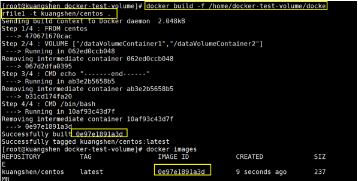
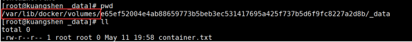
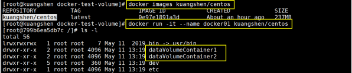
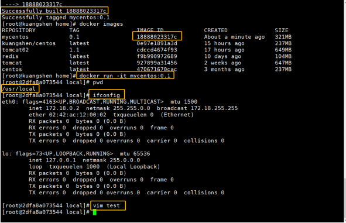
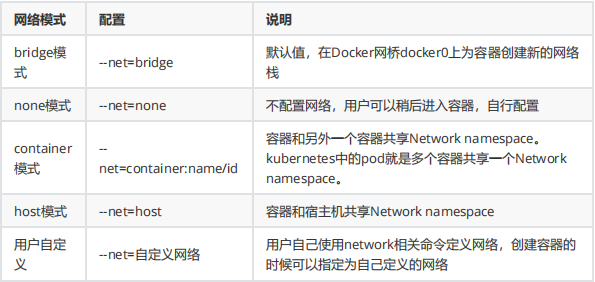
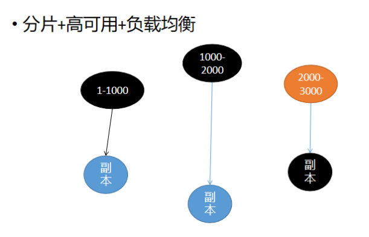
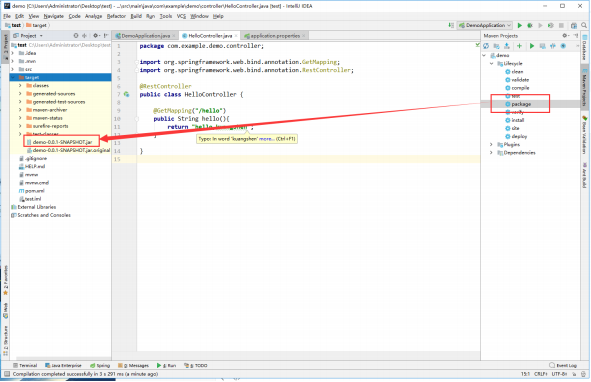

# Docker概述

## Docker为什么出现

>一款产品从开发到上线，从操作系统，到运行环境，再到应用配置。作为开发+运维之间的协作我们需要
关心很多东西，这也是很多互联网公司都不得不面对的问题，特别是各种版本的迭代之后，不同版本环
境的兼容，对运维人员是极大的考验！
环境配置如此麻烦，换一台机器，就要重来一次，费力费时。很多人想到，能不能从根本上解决问题，
软件可以带环境安装？也就是说，安装的时候，把原始环境一模一样地复制过来。解决开发人员说的“ 在
我的机器上可正常工作”的问题。
之前在服务器配置一个应用的运行环境，要安装各种软件，就拿一个基本的工程项目的环境来说吧，
Java/Tomcat/MySQL/JDBC驱动包等。安装和配置这些东西有多麻烦就不说了，它还不能跨平台。假如
我们是在 Windows 上安装的这些环境，到了 Linux 又得重新装。况且就算不跨操作系统，换另一台同
样操作系统的服务器，要移植应用也是非常麻烦的。
传统上认为，软件编码开发/测试结束后，所产出的成果即是程序或是能够编译执行的二进制字节码文件
等（Java为例）。而为了让这些程序可以顺利执行，开发团队也得准备完整的部署文件，让维运团队得
以部署应用程式，开发需要清楚的告诉运维部署团队，用的全部配置文件+所有软件环境。不过，即便如
此，仍然常常发生部署失败的状况。
Docker之所以发展如此迅速，也是因为它对此给出了一个标准化的解决方案。
Docker镜像的设计，使得Docker得以打破过去「程序即应用」的观念。通过Docker镜像 ( images ) 将
应用程序所需要的系统环境，由下而上打包，达到应用程序跨平台间的无缝接轨运作。

  

>Docker的思想来自于集装箱，集装箱解决了什么问题？在一艘大船上，可以把货物规整的摆放起来。并
且各种各样的货物被集装箱标准化了，集装箱和集装箱之间不会互相影响。那么我就不需要专门运送水
果的船和专门运送化学品的船了。只要这些货物在集装箱里封装的好好的，那我就可以用一艘大船把他
们都运走。

docker就是类似的理念。

##### docker 理念

>Docker是基于Go语言实现的云开源项目。
Docker的主要目标是通过对应用组件的封装、分发、部署、运行等生命周期的管理，使用户的APP（可以是一个WEB应用或数据库应用等等）及其运行环境能够做到“一次封装，到处运行”。
Linux 容器技术的出现就解决了这样一个问题，而 Docker 就是在它的基础上发展过来的。将应用运行在
Docker 容器上面，而 Docker 容器在任何操作系统上都是一致的，这就实现了跨平台、跨服务器。只需
要一次配置好环境，换到别的机子上就可以一键部署好，大大简化了操作。

## Docker能干嘛

##### 之前的虚拟机技术

>虚拟机（virtual machine）就是带环境安装的一种解决方案。
它可以在一种操作系统里面运行另一种操作系统，比如在Windows 系统里面运行Linux 系统。应用程序
对此毫无感知，因为虚拟机看上去跟真实系统一模一样，而对于底层系统来说，虚拟机就是一个普通文
件，不需要了就删掉，对其他部分毫无影响。这类虚拟机完美的运行了另一套系统，能够使应用程序，
操作系统和硬件三者之间的逻辑不变。

  

* 虚拟机的缺点：
    * 1 、资源占用多
    * 2 、冗余步骤多
    * 3 、启动慢

##### 容器虚拟化技术

>由于前面虚拟机存在这些缺点，Linux 发展出了另一种虚拟化技术：Linux 容器（Linux Containers，缩
写为 LXC）。
Linux 容器不是模拟一个完整的操作系统，而是对进程进行隔离。有了容器，就可以将软件运行所需的
所有资源打包到一个隔离的容器中。容器与虚拟机不同，不需要捆绑一整套操作系统，只需要软件工作
所需的库资源和设置。系统因此而变得高效轻量并保证部署在任何环境中的软件都能始终如一地运行。<br>
  <br>
比较了 Docker 和传统虚拟化方式的不同之处：
>* 传统虚拟机技术是虚拟出一套硬件后，在其上运行一个完整操作系统，在该系统上再运行所需应用
进程；
>* 而容器内的应用进程直接运行于宿主的内核，容器内没有自己的内核，而且也没有进行硬件虚拟。
因此容器要比传统虚拟机更为轻便。
>* 每个容器之间互相隔离，每个容器有自己的文件系统 ，容器之间进程不会相互影响，能区分计算资
源。

##### 开发/运维（DevOps）

###### 更快速的应用交付和部署：
>传统的应用开发完成后，需要提供一堆安装程序和配置说明文档，安装部署后需根据配置文档进行繁杂
的配置才能正常运行。Docker化之后只需要交付少量容器镜像文件，在正式生产环境加载镜像并运行即
可，应用安装配置在镜像里已经内置好，大大节省部署配置和测试验证时间。
###### 更便捷的升级和扩缩容：
>随着微服务架构和Docker的发展，大量的应用会通过微服务方式架构，应用的开发构建将变成搭乐高积
木一样，每个Docker容器将变成一块“积木”，应用的升级将变得非常容易。当现有的容器不足以支撑业
务处理时，可通过镜像运行新的容器进行快速扩容，使应用系统的扩容从原先的天级变成分钟级甚至秒
级。
###### 更简单的系统运维：
>应用容器化运行后，生产环境运行的应用可与开发、测试环境的应用高度一致，容器会将应用程序相关
的环境和状态完全封装起来，不会因为底层基础架构和操作系统的不一致性给应用带来影响，产生新的
BUG。当出现程序异常时，也可以通过测试环境的相同容器进行快速定位和修复。
###### 更高效的计算资源利用：
>Docker是内核级虚拟化，其不像传统的虚拟化技术一样需要额外的Hypervisor [管理程序] 支持，所以在
一台物理机上可以运行很多个容器实例，可大大提升物理服务器的CPU和内存的利用率。

##### 学习途径

Docker官网：http://www.docker.com

Docker中文网站：https://www.docker-cn.com

Docker Hub官网：https://hub.docker.com （仓库）

# Docker安装

## Docker的基本组成

### Docker的架构图
  
### 镜像（image）：
```
Docker 镜像（Image）就是一个只读的模板。镜像可以用来创建 Docker 容器，一个镜像可以创建很多容器。 就好似 Java 中的 类和对象，类就是镜像，容器就是对象！
```
### 容器（container）：

```
Docker 利用容器（Container）独立运行的一个或一组应用。容器是用镜像创建的运行实例。 
它可以被启动、开始、停止、删除。每个容器都是相互隔离的，保证安全的平台。 
可以把容器看做是一个简易版的 Linux 环境（包括root用户权限、进程空间、用户空间和网络空间等） 和运行在其中的应用程序。
容器的定义和镜像几乎一模一样，也是一堆层的统一视角，唯一区别在于容器的最上面那一层是可读可写的。
```

### 仓库（repository）：
```
仓库（Repository）是集中存放镜像文件的场所。 
仓库(Repository)和仓库注册服务器（Registry）是有区别的。仓库注册服务器上往往存放着多个仓 库，每个仓库中又包含了多个镜像，每个镜像有不同的标签（tag）。 
仓库分为公开仓库（Public）和私有仓库（Private）两种形式。 
最大的公开仓库是 Docker Hub(https://hub.docker.com/)，存放了数量庞大的镜像供用户下载。 
国内的公开仓库包括阿里云 、网易云 等
```
### 小结：

* Docker 本身是一个容器运行载体或称之为管理引擎。我们把应用程序和配置依赖打包好形成一个
可交付的运行环境，这个打包好的运行环境就似乎 image镜像文件。只有通过这个镜像文件才能生
成 Docker 容器。image 文件可以看作是容器的模板。Docker 根据 image 文件生成容器的实例。
同一个 image 文件，可以生成多个同时运行的容器实例。
* image 文件生成的容器实例，本身也是一个文件，称为镜像文件。
* 一个容器运行一种服务，当我们需要的时候，就可以通过docker客户端创建一个对应的运行实例，
也就是我们的容器
* 至于仓库，就是放了一堆镜像的地方，我们可以把镜像发布到仓库中，需要的时候从仓库中拉下来
就可以了。


## 安装步骤

### 1、官网安装参考手册：https://docs.docker.com/engine/install/centos/ <br>
### 2、确定CentOS7版本<br>
### 3、yum安装gcc相关环境（需要确保 虚拟机可以上外网 ）<br>
```
yum -y install gcc 
yum -y install gcc-c++
```
### 4 、卸载旧版本
```
yum remove docker \
                docker-client \ 
                docker-client-latest \ 
                docker-common \ 
                docker-latest \ 
                docker-latest-logrotate \ 
                docker-logrotate \ 
                docker-engine
```

### 5 、安装需要的软件包
```
yum install -y yum-utils
```
### 6 、设置镜像仓库
```
# 错误 
yum-config-manager --add-repo https://download.docker.com/linux/centos/docker-ce.repo 
## 报错 
[Errno 14] curl#35 - TCP connection reset by peer 
[Errno 12] curl#35 - Timeout 

# 正确推荐使用国内的 
yum-config-manager --add-repo http://mirrors.aliyun.com/docker- ce/linux/centos/docker-ce.repo
```
### 7 、更新yum软件包索引
```
yum makecache fast
```
### 8 、安装 Docker CE
```
yum install docker-ce docker-ce-cli containerd.io
```
### 9 、启动 Docker
```
systemctl start docker
```
### 10 、测试命令
```
docker version 
docker run hello-world 
docker images
```
  
### 11 、卸载
```
systemctl stop docker 
yum -y remove docker-ce docker-ce-cli containerd.io 
rm -rf /var/lib/docker
```
## 阿里云镜像加速

### 1 、介绍：https://www.aliyun.com/product/acr

### 2 、注册一个属于自己的阿里云账户(可复用淘宝账号)

### 3 、进入管理控制台设置密码，开通

### 4 、查看镜像加速器自己的
  

### 5 、配置镜像加速
```
sudo mkdir -p /etc/docker 
sudo tee /etc/docker/daemon.json <<-'EOF' 
{ 
    "registry-mirrors": ["https://qiyb9988.mirror.aliyuncs.com"] 
}
EOF 

sudo systemctl daemon-reload 
sudo systemctl restart docker
```
### 测试 HelloWorld

### 1 、启动hello-world
```
docker run hello-world
```
### 2 、run干了什么？
  
## 底层原理

### Docker是怎么工作的

>Docker是一个Client-Server结构的系统，Docker守护进程运行在主机上， 然后通过Socket连接从客户
端访问，守护进程从客户端接受命令并管理运行在主机上的容器。 容器，是一个运行时环境，就是我们
前面说到的集装箱。

  
### 为什么Docker比较 VM 快

1、docker有着比虚拟机更少的抽象层。由亍docker不需要Hypervisor实现硬件资源虚拟化,运行在
docker容器上的程序直接使用的都是实际物理机的硬件资源。因此在CPU、内存利用率上docker将会在
效率上有明显优势。

2、docker利用的是宿主机的内核,而不需要Guest OS。因此,当新建一个容器时,docker不需要和虚拟机
一样重新加载一个操作系统内核。仍而避免引寻、加载操作系统内核返个比较费时费资源的过程,当新建
一个虚拟机时,虚拟机软件需要加载Guest OS,返个新建过程是分钟级别的。而docker由于直接利用宿主
机的操作系统,则省略了返个过程,因此新建一个docker容器只需要几秒钟。
  
# Docker常用命令

## 帮助命令

```
docker version # 显示 Docker 版本信息。
docker info  # 显示 Docker 系统信息，包括镜像和容器数。。
docker --help # 帮助
```

## 镜像命令

### docker images
```shell
# 列出本地主机上的镜像 
[~]# docker images 
REPOSITORY   TAG     IMAGE ID      CREATED SIZE 
hello-world latest bf756fb1ae65 4 months ago 13.3kB 
# 解释 
REPOSITORY 镜像的仓库源 
TAG 镜像的标签 
IMAGE ID 镜像的ID 
CREATED 镜像创建时间 
SIZE 镜像大小 
# 同一个仓库源可以有多个 TAG，代表这个仓库源的不同版本，我们使用REPOSITORY：TAG 定义不同 的镜像，如果你不定义镜像的标签版本，docker将默认使用 lastest 镜像！ 
# 可选项 
-a： 列出本地所有镜像 
-q： 只显示镜像id 
--digests： 显示镜像的摘要信息
```
### docker search
```
# 搜索镜像 
[~]# docker search mysql 
NAME     DESCRIPTION                                       STARS       OFFICIAL 
mysql     MySQL is a widely used, open-source relation…     9484        [OK] 
# docker search 某个镜像的名称 对应DockerHub仓库中的镜像 
# 可选项 
--filter=stars=50 ： 列出收藏数不小于指定值的镜像。
```
### docker pull
```
# 下载镜像 
[~]# 
docker pull mysql 
Using default tag: latest # 不写tag，默认是latest 
latest: Pulling from library/mysql 
54fec2fa59d0: Already exists # 分层下载 
bcc6c6145912: Already exists 
951c3d959c9d: Already exists 
05de4d0e206e: Already exists 
319f0394ef42: Already exists 
d9185034607b: Already exists 
013a9c64dadc: Already exists 
42f3f7d10903: Pull complete 
c4a3851d9207: Pull complete
82a1cc65c182: Pull complete 
a0a6b01efa55: Pull complete 
bca5ce71f9ea: Pull complete 
Digest: 
sha256:61a2a33f4b8b4bc93b7b6b9e65e64044aaec594809f818aeffbff69a893d1944 # 签名
Status: Downloaded newer image for mysql:latest 
docker.io/library/mysql:latest # 真实位置 
# 指定版本下载 
[~]# docker pull mysql:5.7
```
### docker rmi
```
docker rmi -f 镜像id # 删除单个
docker rmi -f 镜像名:tag 镜像名:tag # 删除多个
docker rmi -f $(docker images -qa) # 删除全部
```

## 容器命令

### 说明：有镜像才能创建容器，我们这里使用 centos 的镜像来测试，就是虚拟一个 centos 
```
docker pull centos
```
### 新建容器并启动
```
docker run [OPTIONS] IMAGE [COMMAND][ARG...]
```
```
# 常用参数说明
--name="Name" # 给容器指定一个名字
-d # 后台方式运行容器，并返回容器的id！
-i # 以交互模式运行容器，通过和 -t 一起使用
-t # 给容器重新分配一个终端，通常和 -i 一起使用
-P # 随机端口映射（大写）
-p # 指定端口映射（小结），一般可以有四种写法
    ip:hostPort:containerPort
    ip::containerPort
    hostPort:containerPort (常用)
    containerPort
```
```
# 测试
[~]# docker images
REPOSITORY TAG IMAGE ID       CREATED    SIZE
centos latest 470671670cac 3 months ago 237MB
```
```
# 使用centos进行用交互模式启动容器，在容器内执行/bin/bash命令！
[~]# docker run -it centos /bin/bash
[root@66e5fcd006a3 /]# ls
bin  dev  etc  home  lib  lib64  lost+found  media  mnt  opt  proc  root  run  sbin  srv  sys  tmp  usr  var
[root@66e5fcd006a3 /]#

[root@dc8f24dd06d0 /]# exit # 使用 exit 退出容器 
exit 
[~]#
```

### 列出所有运行的容器
```
# 命令 
docker ps [OPTIONS] 

# 常用参数说明 
-a # 列出当前所有正在运行的容器 + 历史运行过的容器 
-l # 显示最近创建的容器 
-n=? # 显示最近n个创建的容器 
-q # 静默模式，只显示容器编号。
```

### 退出容器
```
exit # 容器停止退出 
ctrl+P+Q # 容器不停止退出
```
### 启动停止容器
```shell
docker start (容器id or 容器名) # 启动容器 
docker restart (容器id or 容器名) # 重启容器 
docker stop (容器id or 容器名) # 停止容器 
docker kill (容器id or 容器名) # 强制停止容器
```
### 删除容器
```shell
docker rm 容器id # 删除指定容器 
docker rm -f $(docker ps -a -q) # 删除所有容器 
docker ps -a -q|xargs docker rm # 删除所有容器
```
## 常用其他命令

### 后台启动容器
```shell
# 命令 
docker run -d 容器名 

# 例子 
docker run -d centos # 启动centos，使用后台方式启动 

# 问题： 使用docker ps 查看，发现容器已经退出了！ 
# 解释：Docker容器后台运行，就必须有一个前台进程，容器运行的命令如果不是那些一直挂起的命 令，就会自动退出。 
# 比如，你运行了nginx服务，但是docker前台没有运行应用，这种情况下，容器启动后，会立即退出，因为他觉得没有程序了，所以最好的情况是，将你的应用使用前台进程的方式运行启动。
```
### 查看日志
```shell
# 命令 
docker logs -f -t --tail 容器id 

# 例子：我们启动 centos，并编写一段脚本来测试玩玩！最后查看日志
[~]# docker run -d centos /bin/sh -c "while true;do echo kuangshen;sleep 1;done" 
[~]# docker ps 
CONTAINER ID      IMAGE 
c8530dbbe3b4      centos 

# -t 显示时间戳 
# -f 打印最新的日志 
# --tail 数字 显示多少条！ 
[~]# docker logs -tf --tail 10 c8530dbbe3b4 
2020-05-11T08:46:40.656901941Z kuangshen 
2020-05-11T08:46:41.658765018Z kuangshen 
2020-05-11T08:46:42.661015375Z kuangshen 
2020-05-11T08:46:43.662865628Z kuangshen 
2020-05-11T08:46:44.664571547Z kuangshen 
2020-05-11T08:46:45.666718583Z kuangshen 
2020-05-11T08:46:46.668556725Z kuangshen 
2020-05-11T08:46:47.670424699Z kuangshen 
2020-05-11T08:46:48.672324512Z kuangshen 
2020-05-11T08:46:49.674092766Z kuangshen
```

### 查看容器中运行的进程信息，支持 ps 命令参数。
```shell
# 命令 
docker top 容器id 

# 测试 
[~]# docker top c8530dbbe3b4 
UID     PID    PPID C STIME TTY TIME    CMD 
root    27437 27421 0 16:43 ? 00:00:00 /bin/sh -c ....
```
### 查看容器/镜像的元数据
```shell
# 命令 
docker inspect 容器id 

# 测试 
[~]# docker inspect c8530dbbe3b4 
[ 
    { # 完整的id，有意思啊，这里上面的容器id，就是截取的这个id前几位！ 
    "Id": "c8530dbbe3b44a0c873f2566442df6543ed653c1319753e34b400efa05f77cf8", 
    "Created": "2020-05-11T08:43:45.096892382Z", 
    "Path": "/bin/sh", 
    "Args": [ 
        "-c", 
        "while true;do echo kuangshen;sleep 1;done" 
    ],
    # 状态 
    "State": { 
        "Status": "running", 
        "Running": true, 
        "Paused": false, 
        "Restarting": false, 
        "OOMKilled": false, 
        "Dead": false,
        "Pid": 27437, 
        "ExitCode": 0, 
        "Error": "", 
        "StartedAt": "2020-05-11T08:43:45.324474622Z", 
        "FinishedAt": "0001-01-01T00:00:00Z" 
        }, 
]
```
### 进入正在运行的容器
```shell
# 命令1 
docker exec -it 容器id bashShell 

# 测试1 
[~]# docker ps 
CONTAINER ID IMAGE      COMMAND             CREATED         STATUS PORTS NAMES 
c8530dbbe3b4 centos "/bin/sh -c 'while t…" 12 minutes ago Up 12 minutes happy_chaum 
[~]# docker exec -it c8530dbbe3b4 /bin/bash 
[root@c8530dbbe3b4 /]# ps -ef
    UID PID PPID C STIME TTY TIME CMD 
    root 1 0 0 08:43 ? 00:00:00 /bin/sh -c while true;do echo kuangshen;sleep 
    root 751 0 0 08:56 pts/0 00:00:00 /bin/bash 
    root 769 1 0 08:56 ? 00:00:00 /usr/bin/coreutils -- coreutils-prog-shebang=s 
    root 770 751 0 08:56 pts/0 00:00:00 ps -ef 
 
 # 命令2 
 docker attach 容器id 
 
 # 测试2 
 [~]# docker exec -it c8530dbbe3b4 /bin/bash 
 [root@c8530dbbe3b4 /]# ps -ef 
 UID PID PPID C STIME TTY TIME CMD 
 root 1 0 0 08:43 ? 00:00:00 /bin/sh -c while true;do echo kuangshen;sleep 
 root 856 0 0 08:57 pts/0 00:00:00 /bin/bash 
 root 874 1 0 08:57 ? 00:00:00 /usr/bin/coreutils -- coreutils-prog-shebang=s 
 root 875 856 0 08:57 pts/0 00:00:00 ps -ef 
 
 # 区别 
 # exec 是在容器中打开新的终端，并且可以启动新的进程 
 # attach 直接进入容器启动命令的终端，不会启动新的进程
```
### 从容器内拷贝文件到主机上
```shell
# 命令 
docker cp 容器id:容器内路径 目的主机路径 

# 测试 
# 容器内执行，创建一个文件测试 
[root@c8530dbbe3b4 /]# cd /home 
[root@c8530dbbe3b4 home]# touch f1 
[root@c8530dbbe3b4 home]# ls
f1
[root@c8530dbbe3b4 home]# exit exit 

# linux复制查看，是否复制成功 
[~]# docker cp c8530dbbe3b4:/home/f1 /home 
[~]# cd /home 
[home]# ls 
f1
```
## 小结
  
### 常用命令
| 命令    | 解释                                                               | 翻译                                                                                    |
|---------|--------------------------------------------------------------------|-----------------------------------------------------------------------------------------|
| attach  | Attach to a running container                                      | 当前 shell 下 连接指定运行镜像                                                          |
| build   | Build an image from a Dockerfile                                   | 通过 Dockerfile 定 制镜像                                                               |
| commit  | Create a new image from a container changes                        | 提交当前容器为新的镜像                                                                  |
| cp      | Copy files/folders from the containers filesystem to the host path | 从容器中拷贝指定文件或者目录到宿主机中                                                  |
| create  | Create a new container                                             | 创建一个新的容器，同 run，但不启动容器                                                  |
| diff    | Inspect changes on a container's filesystem                        | 查看 docker 容器变化                                                                    |
| events  | Get real time events from the server                               | 从 docker 服务获取容 器实时事件                                                         |
| exec    | Run a command in an existing container                             | 在已存在的容器上运行命 令                                                               |
| export  | Stream the contents of a container as a tar archive                | 导出容器的内 容流作为一个 tar 归档文件[对应 import ]                                    |
| history | Show the history of an image                                       | 展示一个镜像形成历史                                                                    |
| images  | List images                                                        | 列出系统当前镜像                                                                        |
| import  | Create a new filesystem image from the contents of a tarball       | 从 tar包中的内容创建一个新的文件系统映像[对应export]                                    |
| info    | Display system-wide information                                    | 显示系统相关信息                                                                        |
| inspect | Return low-level information on a container                        | 查看容器详细信息                                                                        |
| kill    | Kill a running container                                           | kill 指定 docker 容 器                                                                  |
| load    | Load an image from a tar archive                                   | 从一个 tar 包中加载一 个镜像[对应 save]                                                 |
| login   | Register or Login to the docker registry server                    | 注册或者登陆一个 docker 源服务器                                                        |
| logout  | Log out from a Docker registry server                              | 从当前 Docker registry 退出                                                             |
| logs    | Fetch the logs of a container                                      | 输出当前容器日志信息                                                                    |
| port    | Lookup the public-facing port which is NAT-ed to PRIVATE_PORT      | 查看映射端口对应的容器内部源端口                                                        |
| pause   | Pause all processes within a container                             | 暂停容器                                                                                |
| ps      | List containers                                                    | 列出容器列表                                                                            |
| pull    | Pull an image or a repository from the docker registry server      | 从docker镜像源服务器拉取指定镜像或者库镜像                                              |
| push    | Push an image or a repository to the docker registry server        | 推送指定镜像或者库镜像至docker源服务器                                                  |
| restart | Restart a running container                                        | 重启运行的容器                                                                          |
| rm      | Remove one or more containers                                      | 移除一个或者多个容器                                                                    |
| rmi     | Remove one or more images                                          | 移除一个或多个镜像[无容器使用该 镜像才可删除，否则需删除相关容器才可继续或 -f 强制删除] |
| run     | Run a command in a new container                                   | 创建一个新的容器并运行 一个命令                                                         |
| save    | Save an image to a tar archive                                     | 保存一个镜像为一个 tar 包[对应 load]                                                    |
| search  | Search for an image on the Docker Hub                              | 在 docker hub 中搜 索镜像                                                               |
| start   | Start a stopped containers                                         | 启动容器                                                                                |
| stop    | Stop a running containers                                          | 停止容器                                                                                |
| tag     | Tag an image into a repository                                     | 给源中镜像打标签                                                                        |
| top     | Lookup the running processes of a container                        | 查看容器中运行的进程信 息                                                               |
| unpause | Unpause a paused container                                         | 取消暂停容器                                                                            |
| version | Show the docker version information                                | 查看 docker 版本号                                                                      |
| wait    | Block until a container stops, then print its exit code            | 截取容 器停止时的退出状态值                                                             |

## 实例：使用Docker 安装 Nginx

```bash
# 1、搜索镜像 
[~]# docker search nginx 
NAME  DESCRIPTION              STARS OFFICIAL 
nginx Official build of Nginx. 13159 [OK] 
# 2、拉取镜像 
[~]# docker pull nginx 
Using default tag: latest
latest: Pulling from library/nginx 
54fec2fa59d0: Pull complete 
4ede6f09aefe: Pull complete 
f9dc69acb465: Pull complete 
Digest: 
sha256:86ae264c3f4acb99b2dee4d0098c40cb8c46dcf9e1148f05d3a51c4df6758c12 
Status: Downloaded newer image for nginx:latest 
docker.io/library/nginx:latest 

# 3、启动容器 
[~]# docker images 
REPOSITORY TAG    IMAGE ID    CREATED      SIZE 
diytomcat latest ffdf6529937d 3 hours ago 636MB 
nginx     latest 602e111c06b6 2 weeks ago 127MB 
centos    latest 470671670cac 3 months ago 237MB 
[~]# docker run -d --name mynginx -p 3500:80 nginx 
a95d5f2f057fc609082cfa0de906bd690f95c43a26d38420d081f0e255b232ec 
[~]# docker ps 
CONTAINER ID IMAGE PORTS                NAMES 
a95d5f2f057f nginx 0.0.0.0:3500->80/tcp mynginx 

# 4、测试访问 
[~]# curl localhost:3500 
<html>
    <title>Welcome to nginx!</title> # ok .... 
</html> 

# 5、进入容器 
[~]# docker exec -it mynginx /bin/bash 
root@a95d5f2f057f:/# whereis nginx # 寻找nginx 
nginx: /usr/sbin/nginx /usr/lib/nginx /etc/nginx /usr/share/nginx 
root@a95d5f2f057f:/# cd /usr/share/nginx # nginx 的路径 
root@a95d5f2f057f:/usr/share/nginx# ls 
html 
root@a95d5f2f057f:/usr/share/nginx# cd html # 首页的位置 
root@a95d5f2f057f:/usr/share/nginx/html# ls 
50x.html index.html 
root@a95d5f2f057f:/usr/share/nginx/html# cat index.html 
<!DOCTYPE html> 
<html> 
<head> 
<title>Welcome to nginx!</title> 
<style> 
body {
    width: 35em; 
    margin: 0 auto; 
    font-family: Tahoma, Verdana, Arial, sans-serif; 
    } 
</style> 
</head> 
<body> 
<h1>Welcome to nginx!</h1> 
</body> 
</html>
```
### 使用docker安装 tomcat
```shell
# 官方文档解释 
# -it ：交互模式 
# --rm：容器启动成功并退出以后容器就自动移除，一般在测试情况下使用！ 
docker run -it --rm tomcat:9.0 

# 1、下载tomcat镜像 
docker pull tomcat 

# 2、启动 
docker run -d -p 8080:8080 --name tomcat9 tomcat 

# 3、进入tomcat 
docker exec -it tomcat9 /bin/bash 

# 4、思考：我们以后要部署项目，还需要进入容器中，是不是十分麻烦，要是有一种技术，可以将容器 
内和我们Linux进行映射挂载就好了？我们后面会将数据卷技术来进行挂载操作，也是一个核心内容，这 
里大家先听听名词就好，我们很快就会讲到！
```
### 使用docker 部署 es + kibana
```shell
# 我们启动es这种容器需要考虑几个问题 
1、端口暴露问题 9200、9300 
2、数据卷的挂载问题 data、plugins、conf 
3、吃内存 - "ES_JAVA_OPTS=-Xms512m -Xmx512m" 

# 扩展命令 
docker stats 容器id # 查看容器的cpu内存和网络状态 

# 1、启动es测试 
docker run -d --name elasticsearch -p 9200:9200 -p 9300:9300 -e "discovery.type=single-node" elasticsearch:7.6.2 

# 2、启动之后很卡，使用 docker stats 容器id 查看下cpu状态 ，发现占用的很大 
CONTAINER ID NAME          CPU % MEM USAGE / LIMIT   MEM % 
249ae46da625 elasticsearch 0.00% 1.036GiB / 1.716GiB 60.37% 

# 3、测试访问 
[data]# curl localhost:9200 
{ 
    "name" : "249ae46da625", 
    "cluster_name" : "docker-cluster", 
    "cluster_uuid" : "_Ho_i4fOTUesNc_II35sSA", 
    "version" : { 
        "number" : "7.6.2", 
        "build_flavor" : "default", 
        "build_type" : "docker", 
        "build_hash" : "ef48eb35cf30adf4db14086e8aabd07ef6fb113f", 
        "build_date" : "2020-03-26T06:34:37.794943Z",
        "build_snapshot" : false, 
        "lucene_version" : "8.4.0", 
        "minimum_wire_compatibility_version" : "6.8.0", 
        "minimum_index_compatibility_version" : "6.0.0-beta1" 
        },
    "tagline" : "You Know, for Search"
}

# 4、增加上内存限制启动 
docker run -d --name elasticsearch -p 9200:9200 -p 9300:9300 -e "discovery.type=single-node" -e ES_JAVA_OPTS="-Xms64m -Xmx512m" elasticsearch:7.6.2 

# 5、启动之后，使用 docker stats 查看下cpu状态 
CONTAINER ID NAME          CPU % MEM USAGE / LIMIT MEM % 
d2860684e7e4 elasticsearch 0.24% 358.3MiB / 1.716GiB 20.40% 

# 6、测试访问，效果一样，ok！ 
[data]# curl localhost:9200 
# 思考：如果我们要使用 kibana , 如果配置连接上我们的es呢？网络该如何配置呢？
```
  

# Docker镜像讲解

## 镜像是什么

>镜像是一种轻量级、可执行的独立软件包，用来打包软件运行环境和基于运行环境开发的软件，它包含
运行某个软件所需的所有内容，包括代码、运行时、库、环境变量和配置文件。

## Docker镜像加载原理

### UnionFS （联合文件系统）

>UnionFS（联合文件系统）：Union文件系统（UnionFS）是一种分层、轻量级并且高性能的文件系统，
它支持对文件系统的修改作为一次提交来一层层的叠加，同时可以将不同目录挂载到同一个虚拟文件系
统下(unite several directories into a single virtual filesystem)。Union 文件系统是 Docker 镜像的基
础。镜像可以通过分层来进行继承，基于基础镜像（没有父镜像），可以制作各种具体的应用镜像。
特性：一次同时加载多个文件系统，但从外面看起来，只能看到一个文件系统，联合加载会把各层文件
系统叠加起来，这样最终的文件系统会包含所有底层的文件和目录

### Docker镜像加载原理

>docker的镜像实际上由一层一层的文件系统组成，这种层级的文件系统UnionFS。<br>
bootfs(boot file system)主要包含bootloader和kernel, bootloader主要是引导加载kernel, Linux刚启<br>
动时会加载bootfs文件系统，在Docker镜像的最底层是bootfs。这一层与我们典型的Linux/Unix系统是<br>
一样的，包含boot加载器和内核。当boot加载完成之后整个内核就都在内存中了，此时内存的使用权已<br>
由bootfs转交给内核，此时系统也会卸载bootfs。 rootfs (root file system) ，在bootfs之上。包含的就是典型 Linux 系统中的 /dev, /proc, /bin, /etc 等标<br>
准目录和文件。rootfs就是各种不同的操作系统发行版，比如Ubuntu，Centos等等。


### 平时我们安装进虚拟机的CentOS都是好几个G，为什么Docker这里才200M？


对于一个精简的OS，rootfs 可以很小，只需要包含最基本的命令，工具和程序库就可以了，因为底层直
接用Host的kernel，自己只需要提供rootfs就可以了。由此可见对于不同的linux发行版, bootfs基本是一
致的, rootfs会有差别, 因此不同的发行版可以公用bootfs。

## 分层理解

### 分层的镜像

>我们可以去下载一个镜像，注意观察下载的日志输出，可以看到是一层一层的在下载！


>思考：为什么Docker镜像要采用这种分层的结构呢？<br>
最大的好处，我觉得莫过于是资源共享了！比如有多个镜像都从相同的Base镜像构建而来，那么宿主机<br>
只需在磁盘上保留一份base镜像，同时内存中也只需要加载一份base镜像，这样就可以为所有的容器服<br>
务了，而且镜像的每一层都可以被共享。<br>
查看镜像分层的方式可以通过 docker image inspect 命令！

### 理解：

>所有的 Docker 镜像都起始于一个基础镜像层，当进行修改或增加新的内容时，就会在当前镜像层之<br>
上，创建新的镜像层。<br>
举一个简单的例子，假如基于 Ubuntu Linux 16.04 创建一个新的镜像，这就是新镜像的第一层；如果<br>
在该镜像中添加 Python包，就会在基础镜像层之上创建第二个镜像层；如果继续添加一个安全补丁，就<br>
会创建第三个镜像层。<br>
该镜像当前已经包含 3 个镜像层，如下图所示（这只是一个用于演示的很简单的例子）。<br>


>在添加额外的镜像层的同时，镜像始终保持是当前所有镜像的组合，理解这一点非常重要。下图中举了<br>
一个简单的例子，每个镜像层包含 3 个文件，而镜像包含了来自两个镜像层的 6 个文件。<br>


>上图中的镜像层跟之前图中的略有区别，主要目的是便于展示文件。<br>
下图中展示了一个稍微复杂的三层镜像，在外部看来整个镜像只有 6 个文件，这是因为最上层中的文件<br>
7 是文件 5 的一个更新版本。


>这种情况下，上层镜像层中的文件覆盖了底层镜像层中的文件。这样就使得文件的更新版本作为一个新<br>
镜像层添加到镜像当中。<br>
Docker 通过存储引擎（新版本采用快照机制）的方式来实现镜像层堆栈，并保证多镜像层对外展示为统<br>
一的文件系统。<br>
Linux 上可用的存储引擎有 AUFS、Overlay2、Device Mapper、Btrfs 以及 ZFS。顾名思义，每种存储<br>
引擎都基于 Linux 中对应的文件系统或者块设备技术，并且每种存储引擎都有其独有的性能特点。<br>
Docker 在 Windows 上仅支持 windowsfilter 一种存储引擎，该引擎基于 NTFS 文件系统之上实现了分<br>
层和 CoW[1]。<br>
下图展示了与系统显示相同的三层镜像。所有镜像层堆叠并合并，对外提供统一的视图。<br>


### 特点

>Docker镜像都是只读的，当容器启动时，一个新的可写层被加载到镜像的顶部！<br>
这一层就是我们通常说的容器层，容器之下的都叫镜像层！

## 镜像Commit

### docker commit 从容器创建一个新的镜像。
```shell
docker commit 提交容器副本使之成为一个新的镜像！ 
# 语法 
docker commit -m="提交的描述信息" -a="作者" 容器id 要创建的目标镜像名:[标签名]
```
### 测试
```shell
# 1、从Docker Hub 下载tomcat镜像到本地并运行 -it 交互终端 -p 端口映射
docker run -it -p 8080 :8080 tomcat

# 注意：坑爹：docker启动官方tomcat镜像的容器，发现 404 是因为使用了加速器，而加速器里的tomcat的webapps下没有root等文件！
# 下载tomcat官方镜像，就是这个镜像（阿里云里的tomcat的webapps下没有任何文件）
# 进入tomcat查看cd到webapps下发现全部空的，反而有个webapps.dist里有对应文件，cp -r到webapps下！
root@aba865b53114:/usr/local/tomcat# cp -r webapps.dist/* webapps

# 2、删除上一步镜像产生的tomcat容器的文档
docker ps # 查看容器id
docker exec -it 容器id /bin/bash
/usr/local/tomcat # ce webapps/
/usr/local/tomcat/webapps # ls -l # 查看是否存在 docs文件夹
/usr/local/tomcat/webapps # curl localhost:8080/docs/ # 可以看到 docs 返回的内容
/usr/local/tomcat/webapps # rm -rf docs # 删除它
/usr/local/tomcat/webapps # curl localhost:8080/docs/ # 再次访问返回 404

# 3、当前运行的tomcat实例就是一个没有docs的容器，我们使用它为模板commit一个没有docs的tomcat新镜像， tomcat02

docker ps -l # 查看容器的id

# 注意：commit的时候，容器的名字不能有大写，否则报错：invalid reference format
docker commit -a="kuangshen" -m="no tomcat docs" 1e98a2f815b0 tomcat02:1.1
sha256:cdccd4674f93ad34bf73d9db577a20f027a6d03fd1944dc0e628ee4bf17ec748
[/]# docker images # 查看，我们自己提交的镜像已经OK了！
REPOSITORY TAG IMAGE ID CREATED
SIZE
tomcat02 1 .1 cdccd4674f93 About a minute
ago 649MB
redis latest f9b990972689 9 days ago
104MB
tomcat latest 927899a31456 2 weeks ago
647MB
centos latest 470671670cac 3 months ago
237MB

# 4、这个时候，我们的镜像都是可以使用的，大家可以启动原来的tomcat，和我们新的tomcat02来 测试看看！
[~]# docker run -it -p 8080:8080 tomcat02:1.1

# 如果你想要保存你当前的状态，可以通过commit，来提交镜像，方便使用，类似于 VM 中的快照！
```

# 容器数据卷

## 什么是容器数据卷

### docker的理念回顾：

>将应用和运行的环境打包形成容器运行，运行可以伴随着容器，但是我们对于数据的要求，是希望能够<br>
持久化的！<br>
就好比，你安装一个MySQL，结果你把容器删了，就相当于删库跑路了，这TM也太扯了吧！<br>
所以我们希望容器之间有可能可以共享数据，Docker容器产生的数据，如果不通过docker commit 生成<br>
新的镜像，使得数据作为镜像的一部分保存下来，那么当容器删除后，数据自然也就没有了！这样是行<br>
不通的！<br>
为了能保存数据在Docker中我们就可以使用卷！让数据挂载到我们本地！这样数据就不会因为容器删除<br>
而丢失了！<br>
>### 作用：<br>
卷就是目录或者文件，存在一个或者多个容器中，由docker挂载到容器，但不属于联合文件系统，因此<br>
能够绕过 Union File System ， 提供一些用于持续存储或共享数据的特性：<br>
卷的设计目的就是数据的持久化，完全独立于容器的生存周期，因此Docker不会在容器删除时删除其挂
载的数据卷。<br>

### 特点：

* 1、数据卷可在容器之间共享或重用数据
* 2、卷中的更改可以直接生效
* 3、数据卷中的更改不会包含在镜像的更新中
* 4、数据卷的生命周期一直持续到没有容器使用它为止

### 所以：总结一句话： 就是容器的持久化，以及容器间的继承和数据共享！

## 使用数据卷

### 方式一：容器中直接使用命令来添加

### 挂载
```shell
# 命令 
docker run -it -v 宿主机绝对路径目录:容器内目录 镜像名 

# 测试 
[~]# docker run -it -v /home/ceshi:/home centos /bin/bash
```
### 查看数据卷是否挂载成功 docker inspect 容器id

### 测试容器和宿主机之间数据共享：可以发现，在容器中，创建的会在宿主机中看到！

### 测试容器停止退出后，主机修改数据是否会同步！
* 1. 停止容器
* 2. 在宿主机上修改文件，增加些内容
* 3. 启动刚才停止的容器
* 4. 然后查看对应的文件，发现数据依旧同步！ok


### 使用 docker 安装 mysql

### 思考：mysql 数据持久化的问题！
```shell
# 1、搜索镜像
[~]# docker search mysql
NAME DESCRIPTION
STARS
mysql MySQL is a widely used, open-source
relation... 9488

# 2、拉取镜像
[~]# docker pull mysql:5.7
5 .7: Pulling from library/mysql
54fec2fa59d0: Already exists
bcc6c6145912: Pull complete
951c3d959c9d: Pull complete
05de4d0e206e: Pull complete
319f0394ef42: Pull complete
d9185034607b: Pull complete
013a9c64dadc: Pull complete
e745b3361626: Pull complete
03145d87b451: Pull complete
3991a6b182ee: Pull complete
62335de06f7d: Pull complete
Digest:
sha256:e821ca8cc7a44d354486f30c6a193ec6b70a4eed8c8362aeede4e9b8d74b8ebb
Status: Downloaded newer image for mysql:5.7
docker.io/library/mysql:5.7

# 3、启动容器 -e 环境变量！
# 注意： mysql的数据应该不丢失！先体验下 -v 挂载卷！ 参考官方文档
[home]# docker run -d -p 3310:3306 -v /home/mysql/conf:/etc/mysql/conf.d -v /home/mysql/data:/var/lib/mysql -e MYSQL_ROOT_PASSWORD=123456 --name mysql01 mysql:5.7
4763fa5c68c4323688102f57938fb10996a0fb902d2812349286529f9378f16c

# 4、使用本地的sqlyog连接测试一下 3310

# 5、查看本地的 /home/mysql 目录
[data]# pwd
/home/mysql/data
[data]# ls
.. .... test  # 可以看到我们刚刚建立的mysql数据库在本地存储着

# 6、删除mysql容器
[data]# docker rm -f mysql01 # 删除容器，然后发现远程连接失败！
mysql01
[data]# ls
.. .... test # 可以看到我们刚刚建立的mysql数据库在本地存储着
```

### 通过Docker File 来添加（了解）

>DockerFile 是用来构建Docker镜像的构建文件，是由一些列命令和参数构成的脚本。
我们在这里，先体验下，后面我们会详细讲解 DockerFile ！

测试：
```shell
# 1、我们在宿主机 /home 目录下新建一个 docker-test-volume文件夹
[home]# mkdir docker-test-volume

# 说明：在编写DockerFile文件中使用 VOLUME 指令来给镜像添加一个或多个数据卷
VOLUME["/dataVolumeContainer1","/dataVolumeContainer2","/dataVolumeContainer3"]
# 出于可移植和分享的考虑，我们之前使用的 -v 主机目录:容器目录 这种方式不能够直接在DockerFile中实现。
# 由于宿主机目录是依赖于特定宿主机的，并不能够保证在所有宿主机上都存在这样的特定目录.

# 2、编写DockerFile文件
[docker-test-volume]# pwd
/home/docker-test-volume
[docker-test-volume]# vim dockerfile1
[docker-test-volume]# cat dockerfile1
# volume test
FROM centos
VOLUME ["/dataVolumeContainer1","/dataVolumeContainer2"]
CMD echo "-------end------"
CMD /bin/bash

# 3、build后生成镜像，获得一个新镜像 kuangshen/centos

docker build -f /home/docker-test-volume/dockerfile1 -t kuangshen/centos. #注意最后有个.
```



```shell
# 4、启动容器
[docker-test-volume]# docker run -it 0e97e1891a3d /bin/bash #启动容器

[root@f5824970eefc /]# ls -l
total 56
lrwxrwxrwx 1 root root 7 May 11  2019 bin -> usr/bin
drwxr-xr-x 2 root root 4096 May 11 11 :55 dataVolumeContainer1 # 数据卷目录
drwxr-xr-x 2 root root 4096 May 11 11 :55 dataVolumeContainer2 # 数据卷目录
drwxr-xr-x 5 root root 360 May 11 11 :55 dev
drwxr-xr-x 1 root root 4096 May 11 11 :55 etc
drwxr-xr-x 2 root root 4096 May 11  2019 home
.....

# 问题:通过上述步骤，容器内的卷目录地址就已经知道了，但是对应的主机目录地址在哪里呢？

# 5、我们在数据卷中新建一个文件
[root@f5824970eefc dataVolumeContainer1]# pwd
/dataVolumeContainer1
[root@f5824970eefc dataVolumeContainer1]# touch container.txt
[root@f5824970eefc dataVolumeContainer1]# ls -l
total 0
-rw-r--r-- 1 root root 0 May 11 11 :58 container.txt

# 6、查看下这个容器的信息
[~]# docker inspect 0e97e1891a3d
# 查看输出的Volumes
"Volumes": {
"/dataVolumeContainer1": {},
"/dataVolumeContainer2": {}
},

# 7、这个卷在主机对应的默认位置
```


>注意：如果访问出现了 cannot open directory: Permission denied
解决办法：在挂载目录后多加一个 --privileged=true参数即可

```shell
# 匿名挂载 -v 容器内路径 
docker run -d -P --name nginx01 -v /etc/nginx nginx 

# 匿名挂载的缺点，就是不好维护，通常使用命令 docker volume维护 
docker volume ls 

# 具名挂载 -v 卷名:/容器内路径 
docker run -d -P --name nginx02 -v nginxconfig:/etc/nginx nginx 

# 查看挂载的路径 
[~]# docker volume inspect nginxconfig 
[ 
    { "CreatedAt": "2020-05-13T17:23:00+08:00", 
    "Driver": "local", 
    "Labels": null, 
    "Mountpoint": "/var/lib/docker/volumes/nginxconfig/_data", 
    "Name": "nginxconfig", 
    "Options": null, 
    "Scope": "local" 
    } 
]

# 怎么判断挂载的是卷名而不是本机目录名？ 不是/开始就是卷名，是/开始就是目录名 
# 改变文件的读写权限 
# ro: readonly 
# rw: readwrite 
# 指定容器对我们挂载出来的内容的读写权限 
docker run -d -P --name nginx02 -v nginxconfig:/etc/nginx:ro nginx 
docker run -d -P --name nginx02 -v nginxconfig:/etc/nginx:rw nginx
```

## 数据卷容器
>命名的容器挂载数据卷，其他容器通过挂载这个（父容器）实现数据共享，挂载数据卷的容器，称之为
数据卷容器。<br>
我们使用上一步的镜像：kuangshen/centos 为模板，运行容器 docker01，docker02，docker03，他<br>
们都会具有容器卷
```
"/dataVolumeContainer1" 
"/dataVolumeContainer2"
```
我们来测试下，容器间传递共享
### 1 、先启动一个父容器docker01，然后在dataVolumeContainer2新增文件



### 退出不停止：ctrl+P+Q

### 2 、创建docker02，docker03 让他们继承docker01 --volumes-from
```shell
[docker-test-volume]# docker run -it --name docker02 --volumes-from docker01 kuangshen/centos
[root@ea4c82779077 /]# cd /dataVolumeContainer2
[root@ea4c82779077 dataVolumeContainer2]# ls
docker01.txt
[root@95164598b306 dataVolumeContainer2]# touch docker02.txt
[root@95164598b306 dataVolumeContainer2]# ls
docker01.txt docker02.txt

[docker-test-volume]# docker run -it --name docker03 --volumes-from docker01 kuangshen/centos
[root@ea4c82779077 /]# cd /dataVolumeContainer2
[root@ea4c82779077 dataVolumeContainer2]# ls
docker01.txt docker02.txt
[root@95164598b306 dataVolumeContainer2]# touch docker03.txt
[root@95164598b306 dataVolumeContainer2]# ls
docker01.txt docker02.txt docker03.txt
```
### 3 、回到docker01发现可以看到 02 和 03 添加的共享文件
```shell
[docker-test-volume]# docker attach docker01
[root@799b6ea5db7c dataVolumeContainer2]# ls -l
total 0
-rw-r--r-- 1 root root 0 May 11 13 :20 docker01.txt
-rw-r--r-- 1 root root 0 May 11 13 :22 docker02.txt
-rw-r--r-- 1 root root 0 May 11 13 :24 docker03.txt
```
### 4 、删除docker01，docker02 修改后docker03还能不能访问

```shell
[docker-test-volume]# docker rm -f docker01
docker01
[docker-test-volume]# docker attach docker02
[root@ea4c82779077 dataVolumeContainer2]# ls -l
total 0
-rw-r--r-- 1 root root 0 May 11 13 :20 docker01.txt
-rw-r--r-- 1 root root 0 May 11 13 :22 docker02.txt
-rw-r--r-- 1 root root 0 May 11 13 :24 docker03.txt
[root@ea4c82779077 dataVolumeContainer2]# touch docker02-update.txt
[root@ea4c82779077 dataVolumeContainer2]# ls -a
. .. docker01.txt docker02.txt docker02-update.txt docker03.txt
[root@ea4c82779077 dataVolumeContainer2]# Ctrl+P+Q 退出容器
[docker-test-volume]# docker attach docker03
[root@95164598b306 dataVolumeContainer2]# ls -l
total 0
-rw-r--r-- 1 root root 0 May 11 13 :20 docker01.txt
-rw-r--r-- 1 root root 0 May 11 13 :22 docker02.txt
-rw-r--r-- 1 root root 0 May 11 13 :29 docker02-update.txt
-rw-r--r-- 1 root root 0 May 11 13 :24 docker03.txt
```
### 5 、删除docker02 ，docker03还能不能访问
```bash
[docker-test-volume]# docker ps
CONTAINER ID IMAGE
95164598b306 kuangshen/centos
ea4c82779077 kuangshen/centos
[docker-test-volume]# docker rm -f docker02
docker02
[docker-test-volume]# docker attach docker03
[root@95164598b306 dataVolumeContainer2]# ls -l
total 0
-rw-r--r-- 1 root root 0 May 11 13 :20 docker01.txt
-rw-r--r-- 1 root root 0 May 11 13 :22 docker02.txt
-rw-r--r-- 1 root root 0 May 11 13 :29 docker02-update.txt
-rw-r--r-- 1 root root 0 May 11 13 :24 docker03.txt
[root@95164598b306 dataVolumeContainer2]# touch docker03-update.txt
```
### 6 、新建docker04继承docker03，然后再删除docker03，看下是否可以访问！

```shell
[root@2119f4f23a92 /]# cd dataVolumeContainer2
[root@2119f4f23a92 dataVolumeContainer2]# ls -l
total 0
-rw-r--r-- 1 root root 0 May 11 13 :20 docker01.txt
-rw-r--r-- 1 root root 0 May 11 13 :22 docker02.txt
-rw-r--r-- 1 root root 0 May 11 13 :29 docker02-update.txt
-rw-r--r-- 1 root root 0 May 11 13 :32 docker03-update.txt
-rw-r--r-- 1 root root 0 May 11 13 :24 docker03.txt

# 查看当前运行的容器
[docker-test-volume]# docker ps
CONTAINER ID IMAGE NAMES
2119f4f23a92 kuangshen/centos docker04
95164598b306 kuangshen/centos docker03

# 继续删除docker03
[docker-test-volume]# docker rm -f docker03
docker03
[docker-test-volume]# docker attach docker04
[root@2119f4f23a92 dataVolumeContainer2]# ls -l
total 0
-rw-r--r-- 1 root root 0 May 11 13 :20 docker01.txt
-rw-r--r-- 1 root root 0 May 11 13 :22 docker02.txt
-rw-r--r-- 1 root root 0 May 11 13 :29 docker02-update.txt
-rw-r--r-- 1 root root 0 May 11 13 :32 docker03-update.txt
-rw-r--r-- 1 root root 0 May 11 13 :24 docker03.txt
```

### 得出结论：

>容器之间配置信息的传递，数据卷的生命周期一直持续到没有容器使用它为止。<br>
存储在本机的文件则会一直保留！

# DockerFile

>大家想想，Nginx，tomcat，mysql 这些镜像都是哪里来的？官方能写，我们不能写吗？<br>
我们要研究自己如何做一个镜像，而且我们写的微服务项目以及springboot打包上云部署，Docker就是<br>
最方便的。<br>
微服务打包成镜像，任何装了Docker的地方，都可以下载使用，极其的方便。<br>
流程：开发应用=>DockerFile=>打包为镜像=>上传到仓库（私有仓库，公有仓库）=> 下载镜像 => 启动<br>
运行。<br>
还可以方便移植！<br>

## 什么是DockerFile

dockerfile是用来构建Docker镜像的构建文件，是由一系列命令和参数构成的脚本。<br>
构建步骤：<br>
* 1、编写DockerFile文件
* 2、docker build 构建镜像
* 3、docker run
dockerfile文件我们刚才已经编写过了一次，这里我们继续使用 centos 来看！<br>
地址：https://hub.docker.com/_/centos<br>


## DockerFile构建过程

### 基础知识：

* 1、每条保留字指令都必须为大写字母且后面要跟随至少一个参数
* 2、指令按照从上到下，顺序执行
* 3、# 表示注释
* 4、每条指令都会创建一个新的镜像层，并对镜像进行提交

### 流程：

* 1、docker从基础镜像运行一个容器
* 2、执行一条指令并对容器做出修改
* 3、执行类似 docker commit 的操作提交一个新的镜像层
* 4、Docker再基于刚提交的镜像运行一个新容器
* 5、执行dockerfile中的下一条指令直到所有指令都执行完成！

### 说明：
>从应用软件的角度来看，DockerFile，docker镜像与docker容器分别代表软件的三个不同阶段。<br>
* DockerFile 是软件的原材料 （代码）<br>
* Docker 镜像则是软件的交付品 （.apk）<br>
* Docker 容器则是软件的运行状态 （客户下载安装执行）<br>
DockerFile 面向开发，Docker镜像成为交付标准，Docker容器则涉及部署与运维，三者缺一不可！<br>


>DockerFile：需要定义一个DockerFile，DockerFile定义了进程需要的一切东西。DockerFile涉及的内容<br>
包括执行代码或者是文件、环境变量、依赖包、运行时环境、动态链接库、操作系统的发行版、服务进<br>
程和内核进程（当引用进行需要和系统服务和内核进程打交道，这时需要考虑如何设计 namespace的权<br>
限控制）等等。<br>
Docker镜像：在DockerFile 定义了一个文件之后，Docker build 时会产生一个Docker镜像，当运行<br>
Docker 镜像时，会真正开始提供服务；<br>
Docker容器：容器是直接提供服务的。<br>

## DockerFile指令

### 关键字：

```
FROM # 基础镜像，当前新镜像是基于哪个镜像的
MAINTAINER # 镜像维护者的姓名混合邮箱地址
RUN  # 容器构建时需要运行的命令
EXPOSE # 当前容器对外保留出的端口
WORKDIR  # 指定在创建容器后，终端默认登录的进来工作目录，一个落脚点
ENV  # 用来在构建镜像过程中设置环境变量
ADD  # 将宿主机目录下的文件拷贝进镜像且ADD命令会自动处理URL和解压tar压缩包
COPY # 类似ADD，拷贝文件和目录到镜像中！
VOLUME # 容器数据卷，用于数据保存和持久化工作
CMD  # 指定一个容器启动时要运行的命令，dockerFile中可以有多个CMD指令，但只有最后一个生效！
ENTRYPOINT # 指定一个容器启动时要运行的命令！和CMD一样
ONBUILD  # 当构建一个被继承的DockerFile时运行命令，父镜像在被子镜像继承后，父镜像的
ONBUILD被触发
```


## 实战测试

Docker Hub 中99% 的镜像都是通过在base镜像（Scratch）中安装和配置需要的软件构建出来的


### 自定义一个 centos

### 1 、编写DockerFile

### 查看下官方默认的CentOS的情况：

### 目的：使我们自己的镜像具备如下：登陆后的默认路径、vim编辑器、查看网络配置ifconfig支持
### 准备编写DockerFlie文件
```
[home]# mkdir dockerfile-test
[home]# ls
ceshi dockerfile-test docker-test-volume f1
[home]#
[home]# vim mydockerfile-centos # 编辑文件
[home]# cat mydockerfile-centos
FROM centos
MAINTAINER kuangshen<24736743@qq.com>

ENV MYPATH /usr/local
WORKDIR $MYPATH

RUN yum -y install vim
RUN yum -y install net-tools

EXPOSE 80 

CMD echo $MYPATH 
CMD echo "----------end--------" 
CMD /bin/bash
```

### 2 、构建

docker build -f dockerfile地址 - t 新镜像名字:TAG.

会看到 docker build 命令最后有一个.. 表示当前目录****

```shell
[home]# docker build -f mydockerfile-centos -t mycentos:0.1
Sending build context to Docker daemon 6 .144kB
Step 1 /10 : FROM centos
---> 470671670cac
Step 2 /10 : MAINTAINER kuangshen<24736743@qq.com>
---> Running in ac052943c151
Removing intermediate container ac052943c151
---> 9d37c7174860
Step 3 /10 : ENV MYPATH /usr/local
---> Running in a9d43e0b41bb
Removing intermediate container a9d43e0b41bb
---> 7a89b945c3a6
Step 4 /10 : WORKDIR $MYPATH
---> Running in b41f085b06bc
Removing intermediate container b41f085b06bc
---> 022384682f07
Step 5 /10 : RUN yum -y install vim
---> Running in 8a8d351ee43b
CentOS-8 - AppStream 2 .7 MB/s | 7 .0 MB 00 :02

CentOS-8 - Base 1 .1 MB/s | 2 .2 MB 00 :02

CentOS-8 - Extras 6 .3 kB/s | 5 .9 kB 00 :00

Dependencies resolved.
===========================================================================
=====
Package Arch Version Repository
Size
===========================================================================
=====
Installing:
vim-enhanced x86_64 2 :8.0.1763-13.el8 AppStream
 1 .4 M
Installing dependencies:
gpm-libs x86_64 1 .20.7-15.el8 AppStream
39 k
vim-common x86_64 2 :8.0.1763-13.el8 AppStream
 6 .3 M
vim-filesystem noarch 2 :8.0.1763-13.el8 AppStream
48 k
which x86_64 2 .21-10.el8 BaseOS
 49 k

Transaction Summary
===========================================================================
=====
Install 5 Packages

Total download size: 7 .8 M
Installed size: 31 M
Downloading Packages:
(1/5): gpm-libs-1.20.7-15.el8.x86_64.rpm 815 kB/s | 39 kB 00 :00

(2/5): vim-filesystem-8.0.1763-13.el8.noarch.rp 2 .1 MB/s | 48 kB 00 :00

(3/5): which-2.21-10.el8.x86_64.rpm 161 kB/s | 49 kB 00 :00

(4/5): vim-enhanced-8.0.1763-13.el8.x86_64.rpm 3 .1 MB/s | 1 .4 MB 00 :00

(5/5): vim-common-8.0.1763-13.el8.x86_64.rpm 1 .4 MB/s | 6 .3 MB 00 :04

---------------------------------------------------------------------------
-----
Total 1 .4 MB/s | 7 .8 MB 00 :05

warning: /var/cache/dnf/AppStream-02e86d1c976ab532/packages/gpm-libs-
1.20.7-15.el8.x86_64.rpm: Header V3 RSA/SHA256 Signature, key ID 8483c65d:
NOKEY
CentOS-8 - AppStream 786 kB/s | 1 .6 kB 00 :00

Importing GPG key 0x8483C65D:
Userid : "CentOS (CentOS Official Signing Key) <security@centos.org>"
Fingerprint: 99DB 70FA E1D7 CE22 7FB6 4882 05B5 55B3 8483 C65D
From : /etc/pki/rpm-gpg/RPM-GPG-KEY-centosofficial
Key imported successfully
Running transaction check
Transaction check succeeded.
Running transaction test
Transaction test succeeded.
Running transaction
Preparing :
 1 /1
Installing : which-2.21-10.el8.x86_64
1 /5
Installing : vim-filesystem-2:8.0.1763-13.el8.noarch
 2 /5
Installing : vim-common-2:8.0.1763-13.el8.x86_64
 3 /5
Installing : gpm-libs-1.20.7-15.el8.x86_64
 4 /5
Running scriptlet: gpm-libs-1.20.7-15.el8.x86_64
 4 /5
Installing : vim-enhanced-2:8.0.1763-13.el8.x86_64
 5 /5
Running scriptlet: vim-enhanced-2:8.0.1763-13.el8.x86_64
 5 /5
Running scriptlet: vim-common-2:8.0.1763-13.el8.x86_64
 5 /5
Verifying : gpm-libs-1.20.7-15.el8.x86_64
 1 /5

Verifying : vim-common-2:8.0.1763-13.el8.x86_64
 2 /5
Verifying : vim-enhanced-2:8.0.1763-13.el8.x86_64
 3 /5
Verifying : vim-filesystem-2:8.0.1763-13.el8.noarch
 4 /5
Verifying : which-2.21-10.el8.x86_64
5 /5

Installed:
vim-enhanced-2:8.0.1763-13.el8.x86_64 gpm-libs-1.20.7-15.el8.x86_64

vim-common-2:8.0.1763-13.el8.x86_64 vim-filesystem-2:8.0.1763-
13.el8.noarch
which-2.21-10.el8.x86_64

Complete!
Removing intermediate container 8a8d351ee43b
---> 6f6449a55974
Step 6 /10 : RUN yum -y install net-tools
---> Running in 4f2c187b0bed
Last metadata expiration check: 0 :00:12 ago on Tue May 12 03 :07:25 2020.
Dependencies resolved.
===========================================================================
=====
Package Architecture Version Repository
Size
===========================================================================
=====
Installing:
net-tools x86_64 2 .0-0.51.20160912git.el8 BaseOS
323 k

Transaction Summary
===========================================================================
=====
Install 1 Package

Total download size: 323 k
Installed size: 1 .0 M
Downloading Packages:
net-tools-2.0-0.51.20160912git.el8.x86_64.rpm 1 .3 MB/s | 323 kB 00 :00

---------------------------------------------------------------------------
-----
Total 397 kB/s | 323 kB 00 :00

Running transaction check
Transaction check succeeded.
Running transaction test
Transaction test succeeded.
Running transaction
Preparing :
 1 /1
Installing : net-tools-2.0-0.51.20160912git.el8.x86_64
 1 /1
Running scriptlet: net-tools-2.0-0.51.20160912git.el8.x86_64
 1 /1
```

### 3 、运行

```
docker run -it 新镜像名字:TAG
```

### 可以看到，我们自己的新镜像已经支持 vim/ifconfig的命令，扩展OK！

### 4 、列出镜像地的变更历史
```
docker history 镜像名
```


### CMD 和 ENTRYPOINT 的区别

我们之前说过，两个命令都是指定一个容器启动时要运行的命令<br>
CMD：Dockerfile 中可以有多个CMD 指令，但只有最后一个生效，CMD 会被 docker run 之后的参数<br>
替换！<br>
ENTRYPOINT： docker run 之后的参数会被当做参数传递给 ENTRYPOINT，之后形成新的命令组合！<br>
测试<br>

### CMD命令

```shell
# 1、构建dockerfile
[home]# vim dockerfile-cmd-test
[home]# cat dockerfile-cmd-test
FROM centos
CMD [ "ls", "-a" ]

# 2、build 镜像
[home]# docker build -f dockerfile-cmd-test -t cmdtest.
Sending build context to Docker daemon 22 .02kB
Step 1 /2 : FROM centos
---> 470671670cac
Step 2 /2 : CMD [ "ls", "-a" ]
---> Running in a3072987de38
Removing intermediate container a3072987de38
---> 554bc6952657
Successfully built 554bc6952657
Successfully tagged cmdtest:latest

# 3、执行
[home]# docker run 554bc6952657
.dockerenv
bin
dev
etc
home
lib
lib64
......

# 4、如果我们希望用 -l 列表展示信息，我们就需要加上 -l参数
[home]# docker run cmdtest -l
docker: Error response from daemon: OCI runtime create failed:
container_linux.go:349: starting container process caused "exec: \"-l\":
executable file not found in $PATH": unknown.

# 问题：我们可以看到可执行文件找不到的报错，executable file not found。
# 之前我们说过，跟在镜像名后面的是 command，运行时会替换 CMD 的默认值。
# 因此这里的 -l 替换了原来的 CMD，而不是添加在原来的 ls -a 后面。而 -l 根本不是命令，所
以自然找不到。
# 那么如果我们希望加入 -l 这参数，我们就必须重新完整的输入这个命令：

docker run cmdtest ls -al
```
###  ENTRYPOINT命令

```shell
# 1、构建dockerfile
[home]# vim dockerfile-entrypoint-test
[home]# cat dockerfile-entrypoint-test
FROM centos
ENTRYPOINT [ "ls", "-a" ]

# 2、build 镜像
[home]# docker build -f dockerfile-entrypoint-test -t
entrypointtest.
Sending build context to Docker daemon 23 .04kB
Step 1 /2 : FROM centos
---> 470671670cac
Step 2 /2 : ENTRYPOINT [ "ls", "-a" ]
---> Running in bac4ae055630
Removing intermediate container bac4ae055630
---> ae07199f9144
Successfully built ae07199f9144
Successfully tagged entrypointtest:latest

# 3、执行
[home]# docker run ae07199f9144
.dockerenv
bin
dev
etc
home
lib
lib64
......

# 4、测试-l参数，发现可以直接使用，这里就是一种追加，我们可以明显的知道 CMD 和
ENTRYPOINT 的区别了
[home]# docker run entrypointtest -l
total 56
drwxr-xr-x 1 root root 4096 May 12 04 :21.
drwxr-xr-x 1 root root 4096 May 12 04 :21 ..
-rwxr-xr-x 1 root root 0 May 12 04 :21 .dockerenv
lrwxrwxrwx 1 root root 7 May 11  2019 bin -> usr/bin
drwxr-xr-x 5 root root 340 May 12 04 :21 dev
drwxr-xr-x 1 root root 4096 May 12 04 :21 etc
drwxr-xr-x 2 root root 4096 May 11  2019 home
.....
```

### 自定义镜像 tomcat

* 1、 mkdir -p kuangshen/build/tomcat 
* 2、在上述目录下 touch read.txt
* 3、将 JDK 和 tomcat 安装的压缩包拷贝进上一步目录
* 4、在 /kuangshen/build/tomcat 目录下新建一个Dockerfile文件

```shell
# vim Dockerfile

FROM centos
MAINTAINER kuangshen<24736743@qq.com>
#把宿主机当前上下文的read.txt拷贝到容器/usr/local/路径下
COPY read.txt /usr/local/cincontainer.txt
#把java与tomcat添加到容器中
ADD jdk-8u11-linux-x64.tar.gz /usr/local/
ADD apache-tomcat-9.0.22.tar.gz /usr/local/
#安装vim编辑器
RUN yum -y install vim
#设置工作访问时候的WORKDIR路径，登录落脚点
ENV MYPATH /usr/local
WORKDIR $MYPATH
#配置java与tomcat环境变量
ENV JAVA_HOME /usr/local/jdk1.8.0_11
ENV CLASSPATH $JAVA_HOME/lib/dt.jar:$JAVA_HOME/lib/tools.jar
ENV CATALINA_HOME /usr/local/apache-tomcat-9.0.22
ENV CATALINA_BASE /usr/local/apache-tomcat-9.0.22
ENV PATH $PATH:$JAVA_HOME/bin:$CATALINA_HOME/lib:$CATALINA_HOME/bin
#容器运行时监听的端口
EXPOSE 8080
#启动时运行tomcat
# ENTRYPOINT ["/usr/local/apache-tomcat-9.0.22/bin/startup.sh" ]
# CMD ["/usr/local/apache-tomcat-9.0.22/bin/catalina.sh","run"]
CMD /usr/local/apache-tomcat-9.0.22/bin/startup.sh && tail -F
/usr/local/apache-tomcat-9.0.22/bin/logs/catalina.out
```

### 当前文件状态

### 5 、构建镜像

```shell
[tomcat]# docker build -t diytomcat.
.....
Successfully built ffdf6529937d
Successfully tagged diytomcat:latest  # 构建完成

# 查看确定构建完毕！
[tomcat]# docker images
REPOSITORY TAG IMAGE ID CREATED
SIZE
diytomcat latest ffdf6529937d 20 seconds ago
636MB
```

### 6 、运行启动 run
```
docker run -d -p 9090 :8080 --name mydiytomcat -v /home/kuangshen/build/tomcat/test:/usr/local/apache-tomcat-9.0.22/webapps/test -v /home/kuangshen/build/tomcat/tomcat9logs/:/usr/local/apache-tomcat-9.0.22/logs --privileged=true diytomcat
```


>备注：Docker挂载主机目录Docker访问出现cannot open directory .: Permission denied<br>
解决办法：在挂载目录后多加一个--privileged=true参数即可

### 7 、验证测试访问！ curl localhost:9090

### 8 、结合前面学习的容器卷将测试的web服务test发布

### web.xml
```xml
<?xml version="1.0" encoding="UTF-8"?>

<web-app xmlns:xsi="http://www.w3.org/2001/XMLSchema-instance"
xmlns="http://java.sun.com/xml/ns/javaee"
xsi:schemaLocation="http://java.sun.com/xml/ns/javaee
http://java.sun.com/xml/ns/javaee/web-app_2_5.xsd"
id="WebApp_ID" version="2.5">

<display-name>test</display-name>

</web-app>
```
### a.jsp
```jsp
<%@ page language="java" contentType="text/html; charset=UTF-8"
pageEncoding="UTF-8"%>
<!DOCTYPE html PUBLIC "-//W3C//DTD HTML 4.01 Transitional//EN"
"http://www.w3.org/TR/html4/loose.dtd">
<html>
<head>
<meta http-equiv="Content-Type" content="text/html; charset=UTF-8">
<title>hello，kuangshen</title>
</head>
<body>
-----------welcome------------
<%=" my docker tomcat，kuangshen666 "%>
<br>
<br>
<% System.out.println("-------my docker tomcat-------");%>
</body>
</html>
```
### 9 、测试

#### # 查看日志

```shell
[tomcat]# cd tomcat9logs/
[tomcat9logs]# ll
total 24
-rw-r----- 1 root root 6993 May 12 12 :50 catalina.2020-05-12.log
-rw-r----- 1 root root 7024 May 12 12 :53 catalina.out
-rw-r----- 1 root root 0 May 12 12 :47 host-manager.2020-05-12.log
-rw-r----- 1 root root 408 May 12 12 :47 localhost.2020-05-12.log
-rw-r----- 1 root root 150 May 12 12 :53 localhost_access_log.2020-05-12.txt
-rw-r----- 1 root root 0 May 12 12 :47 manager.2020-05-12.log
[tomcat9logs]# cat catalina.out
....
-------my docker tomcat-------  # 搞定
```

## 发布镜像

### DockerHub

### 注册dockerhub https://hub.docker.com/signup，需要有一个账号
```shell
# 1、查看登录命令
[tomcat]# docker login --help
Usage: docker login [OPTIONS] [SERVER]
# 2、登录
[tomcat]# docker login -u kuangshen
Password:
WARNING! Your password will be stored unencrypted in
/root/.docker/config.json.
Configure a credential helper to remove this warning. See
https://docs.docker.com/engine/reference/commandline/login/#credentials-
store
Login Succeeded
# 3、将镜像发布出去
[tomcat]# docker push kuangshen/diytomcat:1.0
The push refers to repository [docker.io/library/diytomcat]
0f02399c6fdf: Preparing
e79ea0c3a34e: Preparing
09281fa8fe38: Preparing
b56a902b0aef: Preparing
0683de282177: Preparing
# 拒绝：请求的资源访问被拒绝
denied: requested access to the resource is denied

# 问题：本地镜像名无帐号信息，解决加 tag即可
docker tag 251ca4419332 kuangshen/diytomcat:1.0

# 再次 push， ok
[tomcat]# docker push kuangshen/diytomcat:1.0
The push refers to repository [docker.io/kuangshen/diytomcat]
0f02399c6fdf: Pushing [========> ]
 9 .729MB/59.76MB
e79ea0c3a34e: Pushing [==========> ]
 3 .188MB/15.41MB
09281fa8fe38: Pushing [> ]
 3 .823MB/324MB
b56a902b0aef: Pushed
0683de282177: Pushing [=> ]
 5 .997MB/237.1MB
```
### 阿里云镜像服务

* 1、登录阿里云
* 2、找到容器镜像服务


### 3 、创建命名空间

### 4 、创建镜像仓库


### 5 、点击进入这个镜像仓库，可以看到所有的信息

### 6 、测试推送发布
```shell
[tomcat]# docker login --username=18225148644 registry.cn-beijing.aliyuncs.com
Password:
WARNING! Your password will be stored unencrypted in
/root/.docker/config.json.
Configure a credential helper to remove this warning. See
https://docs.docker.com/engine/reference/commandline/login/#credentials-
store

Login Succeeded

# 2、设置 tag
docker tag [ImageId] registry.cn-beijing.aliyuncs.com/bilibili-kuangshen/kuangshen-test:[镜像版本号]
[tomcat]# docker tag 251ca4419332 registry.cn-beijing.aliyuncs.com/bilibili-kuangshen/kuangshen-test:v1.0

# 3、推送命令
docker push registry.cn-beijing.aliyuncs.com/bilibili-kuangshen/kuangshen-test:[镜像版本号]

[tomcat]# docker push registry.cn-beijing.aliyuncs.com/bilibili-kuangshen/kuangshen-test:v1.0
```
### 7 、在阿里云镜像仓库查看效果！

## 总结

# Docker-网络讲解

## 理解Docker0

### 准备工作：清空所有的容器，清空所有的镜像
```
docker rm -f $(docker ps -a -q) # 删除所有容器
docker rmi -f $(docker images -qa) # 删除全部镜像
```
### Docker的网络也是十分重要的一个点，希望大家可以认真理解！

### 我们先来做个测试

### 查看本地ip ip addr

### 这里我们分析可得，有三个网络：

```
lo 127.0.0.1 # 本机回环地址
eth0 172 .17.90.138 # 阿里云的私有IP
docker0 172 .18.0.1  # docker网桥
# 问题：Docker 是如何处理容器网络访问的？
```
>我们之前安装ES的时候，留过一个问题，就是安装Kibana的问题，Kibana得指定ES的地址！或者我们<br>
实际场景中，我们开发了很多微服务项目，那些微服务项目都要连接数据库，需要指定数据库的url地<br>
址，通过ip。但是我们用Docker管理的话，假设数据库出问题了，我们重新启动运行一个，这个时候数<br>
据库的地址就会发生变化，docker会给每个容器都分配一个ip，且容器和容器之间是可以互相访问的。<br>
我们可以测试下容器之间能不能ping通过：<br>

```shell
# 启动tomcat01
[~]# docker run -d -P --name tomcat01 tomcat

# 查看tomcat01的ip地址，docker会给每个容器都分配一个ip！
[~]# docker exec -it tomcat01 ip addr
1 : lo: <LOOPBACK,UP,LOWER_UP> mtu 65536 qdisc noqueue state UNKNOWN group
default qlen 1000
link/loopback 00 :00:00:00:00:00 brd 00 :00:00:00:00:00
inet 127.0.0.1/8 scope host lo
valid_lft forever preferred_lft forever
122 : eth0@if123: <BROADCAST,MULTICAST,UP,LOWER_UP> mtu 1500 qdisc noqueue
state UP group default
link/ether 02 :42:ac:12:00:02 brd ff:ff:ff:ff:ff:ff link-netnsid 0
inet 172 .18.0.2/16 brd 172 .18.255.255 scope global eth0
valid_lft forever preferred_lft forever

# 思考，我们的linux服务器是否可以ping通容器内的tomcat ？
[~]# ping 172.18.0.2
PING 172 .18.0.2 (172.18.0.2) 56 (84) bytes of data.
64 bytes from 172 .18.0.2: icmp_seq= 1 ttl= 64 time= 0 .070 ms  # 可以ping通！
```

### 原理

### 1 、每一个安装了Docker的linux主机都有一个docker0的虚拟网卡。这是个桥接网卡，使用了veth-pair技术！

```shell
# 我们再次查看主机的 ip addr
[~]# ip addr
1 : lo: <LOOPBACK,UP,LOWER_UP> mtu 65536 qdisc noqueue state UNKNOWN group
default qlen 1000
link/loopback 00 :00:00:00:00:00 brd 00 :00:00:00:00:00
inet 127.0.0.1/8 scope host lo
valid_lft forever preferred_lft forever
2 : eth0: <BROADCAST,MULTICAST,UP,LOWER_UP> mtu 1500 qdisc pfifo_fast state
UP group default qlen 1000
link/ether 00 :16:3e:30:27:f4 brd ff:ff:ff:ff:ff:ff
inet 172 .17.90.138/20 brd 172 .17.95.255 scope global dynamic eth0
valid_lft 310954997sec preferred_lft 310954997sec
3 : docker0: <BROADCAST,MULTICAST,UP,LOWER_UP> mtu 1500 qdisc noqueue state
UP group default
link/ether 02 :42:bb:71:07:06 brd ff:ff:ff:ff:ff:ff
inet 172 .18.0.1/16 brd 172 .18.255.255 scope global docker0
valid_lft forever preferred_lft forever
123 : vethc8584ea@if122: <BROADCAST,MULTICAST,UP,LOWER_UP> mtu 1500 qdisc
noqueue master docker0 state UP group default
link/ether 0a:4b:bb:40:78:a7 brd ff:ff:ff:ff:ff:ff link-netnsid 0
# 发现：本来我们有三个网络，我们在启动了个tomcat容器之后，多了一个！ 123 的网络！
```

### 2 、每启动一个容器，linux主机就会多了一个虚拟网卡。
```shell
# 我们启动了一个tomcat01，主机的ip地址多了一个 123: vethc8584ea@if122
# 然后我们在tomcat01容器中查看容器的ip是 122: eth0@if123

# 我们再启动一个tomcat02观察
[~]# docker run -d -P --name tomcat02 tomcat

# 然后发现linux主机上又多了一个网卡 125: veth021eeea@if124:
# 我们看下tomcat02的容器内ip地址是 124: eth0@if125:
[~]# docker exec -it tomcat02 ip addr

# 观察现象：
# tomcat --- linux主机 vethc8584ea@if122 ---- 容器内 eth0@if123
# tomcat --- linux主机 veth021eeea@if124 ---- 容器内 eth0@if125
# 相信到了这里，大家应该能看出点小猫腻了吧！只要启动一个容器，就有一对网卡

# veth-pair 就是一对的虚拟设备接口，它都是成对出现的。一端连着协议栈，一端彼此相连着。
# 正因为有这个特性，它常常充当着一个桥梁，连接着各种虚拟网络设备!
# “Bridge、OVS 之间的连接”，“Docker 容器之间的连接” 等等，以此构建出非常复杂的虚拟网络结构，比如 OpenStack Neutron。
```

### 3 、我们来测试下tomcat01和tomcat02容器间是否可以互相ping通
```shell
[~]# docker exec -it tomcat02 ping 172.18.0.2
PING 172 .18.0.2 (172.18.0.2) 56 (84) bytes of data.
64 bytes from 172 .18.0.2: icmp_seq= 1 ttl= 64 time= 0 .110 ms
# 结论：容器和容器之间是可以互相访问的。
```
### 4 、我们来画一个网络模型图


>结论：tomcat1和tomcat2共用一个路由器。是的，他们使用的一个，就是docker0。任何一个容器启动<br>
默认都是docker0网络。<br>
docker默认会给容器分配一个可用ip。<br>
### 小结

>Docker使用Linux桥接，在宿主机虚拟一个Docker容器网桥(docker0)，Docker启动一个容器时会根据<br>
Docker网桥的网段分配给容器一个IP地址，称为Container-IP，同时Docker网桥是每个容器的默认网<br>
关。因为在同一宿主机内的容器都接入同一个网桥，这样容器之间就能够通过容器的Container-IP直接<br>
通信。<br>


>Docker容器网络就很好的利用了Linux虚拟网络技术，在本地主机和容器内分别创建一个虚拟接口，并<br>
让他们彼此联通（这样一对接口叫veth pair）；<br>
Docker中的网络接口默认都是虚拟的接口。虚拟接口的优势就是转发效率极高（因为Linux是在内核中<br>
进行数据的复制来实现虚拟接口之间的数据转发，无需通过外部的网络设备交换），对于本地系统和容<br>
器系统来说，虚拟接口跟一个正常的以太网卡相比并没有区别，只是他的速度快很多。<br>

## --Link

>思考一个场景，我们编写一个微服务，数据库连接地址原来是使用ip的，如果ip变化就不行了，那我们<br>
能不能使用服务名访问呢？<br><br>
jdbc:mysql://mysql:3306，这样的话哪怕mysql重启，我们也不需要修改配置了！docker提供了 --link<br>
的操作！<br>

```shell
# 我们使用tomcat02，直接通过容器名ping tomcat01，不使用ip
[~]# docker exec -it tomcat02 ping tomcat01
ping: tomcat01: Name or service not known  # 发现ping不通

# 我们再启动一个tomcat03，但是启动的时候连接tomcat02
[~]# docker run -d -P --name tomcat03 --link tomcat02 tomcat
a3a4a17a2b707766ad4f2bb967ce1d94f658cd4cccef3bb8707395cdc71fa1e7

# 这个时候，我们就可以使用tomcat03 ping通tomcat02 了
[~]# docker exec -it tomcat03 ping tomcat02
PING tomcat02 (172.18.0.3) 56 (84) bytes of data.
64 bytes from tomcat02 (172.18.0.3): icmp_seq= 1 ttl= 64 time= 0 .093 ms
64 bytes from tomcat02 (172.18.0.3): icmp_seq= 2 ttl= 64 time= 0 .066 ms

# 再来测试，tomcat03 是否可以ping tomcat01 失败
[~]# docker exec -it tomcat03 ping tomcat01
ping: tomcat01: Name or service not known

# 再来测试，tomcat02 是否可以ping tomcat03 反向也ping不通
[~]# docker exec -it tomcat02 ping tomcat03
ping: tomcat03: Name or service not known
```
### 思考，这个原理是什么呢？我们进入tomcat03中查看下host配置文件
```shell
[~]# docker exec -it tomcat03 cat /etc/hosts
127.0.0.1 localhost
::1 localhost ip6-localhost ip6-loopback
fe00::0 ip6-localnet
ff00::0 ip6-mcastprefix
ff02::1 ip6-allnodes
ff02::2 ip6-allrouters
172 .18.0.3 tomcat02 b80da266a3ad  # 发现tomcat2直接被写在这里
172 .18.0.4 a3a4a17a2b70

# 所以这里其实就是配置了一个 hosts 地址而已！
# 原因：--link的时候，直接把需要link的主机的域名和ip直接配置到了hosts文件中了。
```
##### --link早都过时了，我们不推荐使用！我们可以使用自定义网络的方式

## 自定义网络

### 基本命令查看

### 命令如下：

### 查看所有网络
```
[~]# docker network ls
NETWORK ID NAME DRIVER SCOPE
4eb2182ac4b2 bridge bridge local
ae2b6209c2ab host host local
c037f7ec7e57 none null local
```
### 网络模式


### 查看一个具体的网络的详细信息


```shell
# 命令
[~]# docker network inspect 4eb2182ac4b2
[
{
"Name": "bridge",
"Id":
"4eb2182ac4b23487e1eb6e06df56c71ab6f0adc7ccc0962b4747d0eed5ad6690",
"Created": "2020-05-11T15:44:20.131441544+08:00",
"Scope": "local",
"Driver": "bridge",
"EnableIPv6": false,
"IPAM": {
"Driver": "default",
"Options": null,
"Config": [
{
// 默认docker0是管理这个子网范围内的。0~16，也就是 255 *255，去
掉 0 个 255 ，我们有 65534 可以分配的ip
// docker0网络默认可以支持创建 6 万多个容器ip不重复
"Subnet": "172.18.0.0/16",
"Gateway": "172.18.0.1"
}
]
},
"Internal": false,
"Attachable": false,
"Ingress": false,
"ConfigFrom": {
"Network": ""
},
"ConfigOnly": false,
"Containers": {
"a3a4a17a2b707766ad4f2bb967ce1d94f658cd4cccef3bb8707395cdc71fa1e7": {
"Name": "tomcat03",
"EndpointID":
"5fe62d0be3a1343aa74f6bb77885d3657b191210cafad200e5054e1bdfe56be9",
"MacAddress": "02:42:ac:12:00:04",
"IPv4Address": "172.18.0.4/16",
"IPv6Address": ""
},
"b80da266a3ad85fcc874c5f0d3c897246ebc40533cb745bb24180237cc3167b1": {
"Name": "tomcat02",
"EndpointID":
"6232cac0c4e7fed30c9fa5eebc9238f9fc44f548f257344b5440d6d486825256",
"MacAddress": "02:42:ac:12:00:03",
"IPv4Address": "172.18.0.3/16",
"IPv6Address": ""
},
"f38239e2b405bccf8c93bd1052f336f661033b9b27ef9b3f99a018c108e06f87": {
"Name": "tomcat01",
"EndpointID":
"31dc174b8f3f15f217acdc3ac7e8a235a03d59438f863706c0143b4426772c5e",
"MacAddress": "02:42:ac:12:00:02",
"IPv4Address": "172.18.0.2/16",
"IPv6Address": ""
}
},
"Options": {
"com.docker.network.bridge.default_bridge": "true",
"com.docker.network.bridge.enable_icc": "true",
"com.docker.network.bridge.enable_ip_masquerade": "true",
"com.docker.network.bridge.host_binding_ipv4": "0.0.0.0",
"com.docker.network.bridge.name": "docker0",
"com.docker.network.driver.mtu": "1500"
},
"Labels": {}
}
]
```
### 自定义网卡

### 1 、删除原来的所有容器

```shell
[~]# docker rm -f $(docker ps -aq)

# 恢复到了最开始的样子
[~]# ip addr
1 : lo: <LOOPBACK,UP,LOWER_UP> mtu 65536 qdisc noqueue state UNKNOWN group
default qlen 1000
link/loopback 00 :00:00:00:00:00 brd 00 :00:00:00:00:00
inet 127.0.0.1/8 scope host lo
valid_lft forever preferred_lft forever
2 : eth0: <BROADCAST,MULTICAST,UP,LOWER_UP> mtu 1500 qdisc pfifo_fast state
UP group default qlen 1000
link/ether 00 :16:3e:30:27:f4 brd ff:ff:ff:ff:ff:ff
inet 172 .17.90.138/20 brd 172 .17.95.255 scope global dynamic eth0
valid_lft 310951436sec preferred_lft 310951436sec
3 : docker0: <NO-CARRIER,BROADCAST,MULTICAST,UP> mtu 1500 qdisc noqueue state
DOWN group default
link/ether 02 :42:bb:71:07:06 brd ff:ff:ff:ff:ff:ff
inet 172 .18.0.1/16 brd 172 .18.255.255 scope global docker0
valid_lft forever preferred_lft forever
```

### 2 、接下来我们来创建容器，但是我们知道默认创建的容器都是docker0网卡的
```shell
# 默认我们不配置网络，也就相当于默认值 --net bridge 使用的docker0
docker run -d -P --name tomcat01 --net bridge tomcat

# docker0网络的特点
    1 .它是默认的
    2 .域名访问不通
    3 .--link 域名通了，但是删了又不行
```
### 3 、我们可以让容器创建的时候使用自定义网络

```shell
# 自定义创建的默认default "bridge"
# 自定义创建一个网络网络
[~]# docker network create --driver bridge --subnet 192.168.0.0/16 --gateway 192.168.0.1 mynet
09bd09d8d3a6b33e6d19f49643dab551e5a45818baf4d5328aa7320c6dcfc236

# 确认下
[~]# docker network ls
NETWORK ID NAME DRIVER SCOPE
4eb2182ac4b2 bridge bridge local
ae2b6209c2ab host host local
09bd09d8d3a6 mynet bridge local
c037f7ec7e57 none null local
[~]# docker network inspect mynet
[
{
"Name": "mynet",
"Id":
"09bd09d8d3a6b33e6d19f49643dab551e5a45818baf4d5328aa7320c6dcfc236",
"Created": "2020-05-13T13:29:33.568644836+08:00",
"Scope": "local",
"Driver": "bridge",
"EnableIPv6": false,
"IPAM": {
"Driver": "default",
"Options": {},
"Config": [
{
"Subnet": "192.168.0.0/16",
"Gateway": "192.168.0.1"
}
]
},
"Internal": false,
"Attachable": false,
"Ingress": false,
"ConfigFrom": {
"Network": ""
},
"ConfigOnly": false,
"Containers": {},
"Options": {},
"Labels": {}
}
]
# 我们来启动两个容器测试，使用自己的 mynet！
[~]# docker run -d -P --name tomcat-net-01 --net mynet tomcat
065f82e947c760c63539ab4c0de0d683787ec7ac6d0dcaa71f64e191319f9fe7
[~]# docker run -d -P --name tomcat-net-02 --net mynet tomcat
2e85d71afe87c87166786b0bbae2d90eefb969d716fcd78a21173add5956cb12
[~]# docker ps
CONTAINER ID IMAGE PORTS NAMES
2e85d71afe87 tomcat 0 .0.0.0:32772->8080/tcp tomcat-net-02
065f82e947c7 tomcat 0 .0.0.0:32771->8080/tcp tomcat-net-01

# 再来查看下
[~]# docker network inspect mynet
[
{
"Name": "mynet",
"Id":
"09bd09d8d3a6b33e6d19f49643dab551e5a45818baf4d5328aa7320c6dcfc236",
............
"Containers": {
"065f82e947c760c63539ab4c0de0d683787ec7ac6d0dcaa71f64e191319f9fe7": {
"Name": "tomcat-net-01",
"EndpointID":
"d61cef1bc294d7f10fb6d9b728735fc87bed79e4e02f5298374f0fab3e9b2da6",
"MacAddress": "02:42:c0:a8:00:02",
"IPv4Address": "192.168.0.2/16",
"IPv6Address": ""
},
"2e85d71afe87c87166786b0bbae2d90eefb969d716fcd78a21173add5956cb12": {
"Name": "tomcat-net-02",
"EndpointID":
"adbc37a20526c2985c3589382998a3d106ef722662c7b296a57d8a7c8f449f38",
"MacAddress": "02:42:c0:a8:00:03",
"IPv4Address": "192.168.0.3/16",
"IPv6Address": ""
}
},
"Options": {},
"Labels": {}
}
]
# 我们来测试ping容器名和ip试试，都可以ping通
[~]# docker exec -it tomcat-net-01 ping 192.168.0.3
PING 192 .168.0.3 (192.168.0.3) 56 (84) bytes of data.
64 bytes from 192 .168.0.3: icmp_seq= 1 ttl= 64 time= 0 .093 ms

[~]# docker exec -it tomcat-net-01 ping tomcat-net-02
PING tomcat-net-02 (192.168.0.3) 56 (84) bytes of data.
64 bytes from tomcat-net-02.mynet (192.168.0.3): icmp_seq= 1 ttl= 64
time= 0 .063 ms
64 bytes from tomcat-net-02.mynet (192.168.0.3): icmp_seq= 2 ttl= 64
time= 0 .066 ms

# 发现，我们自定义的网络docker都已经帮我们维护好了对应的关系
# 所以我们平时都可以这样使用网络，不使用--link效果一样，所有东西实时维护好，直接域名 ping通。
```

### 聊了这么多，我们现在应该可以深刻理解docker的网络了！

## 网络连通


>docker0和自定义网络肯定不通，我们使用自定义网络的好处就是网络隔离：<br><br>
大家公司项目部署的业务都非常多，假设我们有一个商城，我们会有订单业务（操作不同数据），会有<br>
订单业务购物车业务（操作不同缓存）。如果在一个网络下，有的程序猿的恶意代码就不能防止了，所<br>
以我们就在部署的时候网络隔离，创建两个桥接网卡，比如订单业务（里面的数据库，redis，mq，全<br>
部业务 都在order-net网络下）其他业务在其他网络。<br>
那关键的问题来了，如何让 tomcat-net-01 访问 tomcat1？<br>

```shell
# 启动默认的容器，在docker0网络下
[~]# docker run -d -P --name tomcat01 tomcat
bcd122e0dcf6bf8c861eaa934911f98a5497a4954f3fde9575e496160bd23287
[~]# docker run -d -P --name tomcat02 tomcat
6183aaeca003a3e5a3549a37f9c1040551320ae358807b4aaad547a986afb887
#### # 查看当前的容器
[~]# docker ps
CONTAINER ID IMAGE PORTS NAMES
6183aaeca003 tomcat 0 .0.0.0:32774->8080/tcp tomcat02
bcd122e0dcf6 tomcat 0 .0.0.0:32773->8080/tcp tomcat01
2e85d71afe87 tomcat 0 .0.0.0:32772->8080/tcp tomcat-
net-02
065f82e947c7 tomcat 0 .0.0.0:32771->8080/tcp tomcat-
net-01

# 我们来查看下network帮助，发现一个命令 connect
[~]# docker network --help
Commands:
connect Connect a container to a network  # 连接一个容器到一个网络
create Create a network
disconnect Disconnect a container from a network
inspect Display detailed information on one or more networks
ls List networks
prune Remove all unused networks
rm Remove one or more networks

# 我们来测试一下！打通mynet-docker0
# 命令 docker network connect [OPTIONS] NETWORK CONTAINER

[~]# docker network connect mynet tomcat01
[~]# docker network inspect mynet
[
{
......
"Containers": {
"065f82e947c760c63539ab4c0de0d683787ec7ac6d0dcaa71f64e191319f9fe7": {
"Name": "tomcat-net-01",
"EndpointID":
"d61cef1bc294d7f10fb6d9b728735fc87bed79e4e02f5298374f0fab3e9b2da6",
"MacAddress": "02:42:c0:a8:00:02",
"IPv4Address": "192.168.0.2/16",
"IPv6Address": ""
},
"2e85d71afe87c87166786b0bbae2d90eefb969d716fcd78a21173add5956cb12": {
"Name": "tomcat-net-02",
"EndpointID":
"adbc37a20526c2985c3589382998a3d106ef722662c7b296a57d8a7c8f449f38",
"MacAddress": "02:42:c0:a8:00:03",
"IPv4Address": "192.168.0.3/16",
"IPv6Address": ""
},
// 发现我们的tomcat01就进来这里了，tomcat01拥有了双ip
"bcd122e0dcf6bf8c861eaa934911f98a5497a4954f3fde9575e496160bd23287": {
"Name": "tomcat01",
"EndpointID":
"b2bf2342948e17048d872a4d5603c77e90d0e032439d510e86c10a1acc3928d9",
"MacAddress": "02:42:c0:a8:00:04",
"IPv4Address": "192.168.0.4/16",
"IPv6Address": ""
   }

  },

 }
]
# tomcat01 可以ping通了
[~]# docker exec -it tomcat01 ping tomcat-net-01
PING tomcat-net-01 (192.168.0.2) 56 (84) bytes of data.
64 bytes from tomcat-net-01.mynet (192.168.0.2): icmp_seq= 1 ttl= 64
time= 0 .071 ms
64 bytes from tomcat-net-01.mynet (192.168.0.2): icmp_seq= 2 ttl= 64
time= 0 .067 ms
# tomcat02 依旧ping不通，大家应该就理解了
[~]# docker exec -it tomcat02 ping tomcat-net-01
ping: tomcat-net-01: Name or service not known
```

### 结论：如果要跨网络操作别人，就需要使用 docker network connect [OPTIONS] NETWORK CONTAINER 连接

## 实战：部署一个Redis集群


```shell
# 创建网卡
docker network create redis --subnet 172 .38.0.0/16

# 通过脚本创建六个redis配置
for port in $(seq 1 6); \
do \
mkdir -p /mydata/redis/node-${port}/conf
touch /mydata/redis/node-${port}/conf/redis.conf
cat << EOF >/mydata/redis/node-${port}/conf/redis.conf
port 6379
bind 0 .0.0.0
cluster-enabled yes
cluster-config-file nodes.conf
cluster-node-timeout 5000
cluster-announce-ip 172 .38.0.1${port}
cluster-announce-port 6379
cluster-announce-bus-port 16379
appendonly yes
EOF
done

docker run -p 637 ${port}:6379 -p 1637 ${port}:16379 --name redis-${port} \
-v /mydata/redis/node-${port}/data:/data \
-v /mydata/redis/node-${port}/conf/redis.conf:/etc/redis/redis.conf \
-d --net redis --ip 172 .38.0.1${port} redis:5.0.9-alpine3.11 redis-server/etc/redis/redis.conf; \

# 启动 6 个容器
docker run -p 6371 :6379 -p 16371 :16379 --name redis-1 \
-v /mydata/redis/node-1/data:/data \
-v /mydata/redis/node-1/conf/redis.conf:/etc/redis/redis.conf \
-d --net redis --ip 172 .38.0.11 redis:5.0.9-alpine3.11 redis-server/etc/redis/redis.conf

docker run -p 6376 :6379 -p 16376 :16379 --name redis-6 \
-v /mydata/redis/node-6/data:/data \
-v /mydata/redis/node-6/conf/redis.conf:/etc/redis/redis.conf \
-d --net redis --ip 172 .38.0.16 redis:5.0.9-alpine3.11 redis-server/etc/redis/redis.conf

# 进入一个redis，注意这里是 sh命令
docker exec -it redis-1 /bin/sh

# 创建集群
redis-cli --cluster create 172.38.0.11:6379 172.38.0.12:6379 172.38.0.13:6379 172.38.0.14:6379 172.38.0.15:6379 172.38.0.16:6379 --cluster-replicas 1

# 连接集群
redis-cli -c

# 查看集群信息
cluster info

# 查看节点
cluster nodes

# set a b
# 停止到存值的容器
# 然后再次get a，发现依旧可以获取值
# 查看节点，发现高可用完全没问题
```

# IDEA整合Docker

## 创建项目

* 1、使用 IDEA 构建一个 SpringBoot 项目
* 2、编写一个helloController

```java
@RestController
public class HelloController {
    @GetMapping("/hello")
    public String hello(){
      return "hello,kuangshen";
    }
}
```
### 3 、启动测试下，端口修改下，避免 8080 冲突！本地访问没问题就可以！

### 4 、打jar包

##### 有了 jar 包，我们就可以作镜像了！ 记得测试一下jar包可以使用吗！

## 打包镜像

##### 1 、在项目下编写 Dockerfile 文件，将打包好的jar包拷贝到Dockerfile同级目录
```shell
FROM java:8

# 服务器只有dockerfile和jar在同级目录
COPY *.jar /app.jar

CMD ["--server.port=8080"]

# 指定容器内要暴露的端口
EXPOSE 8080

ENTRYPOINT ["java","-jar","/app.jar"]
```
##### 2 、将Dockerfile 和 项目的 jar 包上传到linux服务器上，构建运行
```shell
[idea]# pwd
/home/idea
[idea]# ll
total 17228
-rw-r--r-- 1 root root 17634294 May 14 12 :33 demo-0.0.1-SNAPSHOT.jar
-rw-r--r-- 1 root root 207 May 14 12 :32 Dockerfile

# 构建镜像
docker build -t idea-ks.

# 查看镜像
docker images

# 运行
docker run -d -P --name idea-ks idea-ks

[~]# docker ps
CONTAINER ID IMAGE PORTS NAMES
2366c960ba99 idea-ks 0 .0.0.0:32779->8080/tcp idea-ks1

# 测试访问
[~]# curl localhost:32779
[~]# curl localhost:32779/hello
```
