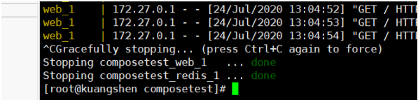

#
# Docker Compose

## 简介
>Docker<br>
DockerFile build run 手动操作，单个容器！<br>
微服务。 100 个微服务！依赖关系。<br>
Docker Compose 来轻松高效的管理容器i。定义运行多个容器。<br>
官方介绍<br>
定义、运行多个容器。<br>
YAML file 配置文件。<br>
single command。 命令有哪些？<br>
Compose is a tool for defining and running multi-container Docker applications. With Compose,<br>
you use a YAML file to configure your application’s services. Then, with a single command, you<br>
create and start all the services from your configuration. To learn more about all the features of<br>
Compose, see the list of features.<br>
所有的环境都可以使用 Compose。<br>
Compose works in all environments: production, staging, development, testing, as well as CI<br>
workflows. You can learn more about each case in Common Use Cases.<br>


**三步骤：**

Using Compose is basically a three-step process:
1. Define your app’s environment with a `Dockerfile` so it can be reproduced anywhere.
    * Dockerfile 保证我们的项目在任何地方可以运行。
2. Define the services that make up your app in `docker-compose.yml` so they can be run together in an isolated environment.
    * services 什么是服务。
    * docker-compose.yml 这个文件怎么写！
3. Run `docker-compose up` and Compose starts and runs your entire app.
    * 启动项目

作用：批量容器编排。

我自己理解

>Compose 是Docker官方的开源项目。需要安装！<br>
`Dockerfile` 让程序在任何地方运行。 web服务。 redis、mysql、nginx ... 多个容器。 run Compose

```shell
version: '2.0'
services:
    web:
        build:.
        ports:
        - "5000:5000"
        volumes:
        - .:/code
        - logvolume01:/var/log
        links:
        - redis
    redis:
        image: redis
    volumes:
        logvolume01: {}
```

>docker-compose up 100 个服务。<br>
Compose ：重要的概念。<br>
服务services， 容器。应用。（web、redis、mysql....）<br>
项目project。 一组关联的容器。 博客。web、mysql。<br>

## 安装

#### 1 、下载
```shell
sudo curl -L "https://github.com/docker/compose/releases/download/1.26.2/docker-compose-$(uname -s)-$(uname -m)" -o /usr/local/bin/docker-compose
# 这个可能快点！
curl -L https://get.daocloud.io/docker/compose/releases/download/1.25.5/docker-compose-`uname -s`-`uname -m` > /usr/local/bin/docker-compose
```

#### 2 、授权
```
sudo chmod +x /usr/local/bin/docker-compose
```
#### 多看官网.....

## 体验

地址：https://docs.docker.com/compose/gettingstarted/ <br>
python 应用。计数器。 redis！<br>

* 1 、应用 app.py
* 2 、Dockerfile 应用打包为镜像
* 3 、Docker-compose yaml文件 （定义整个服务，需要的环境。 web、redis） 完整的上线服务！
* 4 、启动 compose 项目（docker-compose up）

#### 流程：

* 1 、创建网络
* 2 、执行 Docker-compose yaml
* 3 、启动服务。
Docker-compose yaml<br>
Creating composetest_web_1 ... done<br>
Creating composetest_redis_1 ... done<br>

* 1 、文件名 composetest
* 2 、服务

```
version: '3'
services:
    web:
        build:.
        ports:
            - "5000:5000"
    redis:
        image: "redis:alpine"
```

#### 自动的默认规则？


docker imgaes


```
[root@kuangshen ~]# docker service ls
Error response from daemon: This node is not a swarm manager. Use "docker
swarm init" or "docker swarm join" to connect this node to swarm and try
again.
```
>默认的服务名 文件名_服务名 _ num<br>
多个服务器。集群。A B _num 副本数量<br>
服务redis服务 => 4个副本。<br>
集群状态。服务都不可能只有一个运行实例。 弹性、10 HA 高并发。<br>
kubectl service 负载均衡。<br>

3 、网络规则

#### 10 个服务 => 项目 （项目中的内容都在同个网络下。域名访问）

#### 如果在同一个网络下，我们可以直接通过域名访问。

#### HA！

停止： docker-compose down ctrl+c



docker-compose<br>
以前都是单个 docker run 启动容器。<br>
docker-compose。 通过 docker-compose 编写 yaml配置文件、可以通过 compose 一键启动所有服<br>
务，停止。！<br>

**Docker小结：**
* 1 、Docker 镜像。 run => 容器
* 2 、DockerFile 构建镜像（服务打包）
* 3 、docker-compose 启动项目（编排、多个微服务/环境）
* 4 、Docker 网络

### yaml 规则

docker-compose.yaml 核心。！
https://docs.docker.com/compose/compose-file/#compose-file-structure-and-examples

```shell
# 3层！
version: '' # 版本 
services: # 服务 
    服务1: web 
    # 服务配置 
      images 
      build 
      network 
      ..... 
      服务2: redis 
      .... 
      服务3: redis 
# 其他配置 网络/卷、全局规则 
volumes: 
networks: 
configs:
```

#### 学习，要掌握规律！

只要多写，多看。 compose.yaml 配置。！
* 1 、官网文档
https://docs.docker.com/compose/compose-file/#specifying-durations
* 2 、开源项目 compose.yaml
redis、mysql、mq！

## 开源项目

### 博客

#### 下载程序、安装数据库、配置.....

compose 应用。=> 一键启动！
* 1 、下载项目（docker-compose.yaml）
* 2 、如果需要文件。Dcokerfile
* 3 、文件准备齐全（直接一键启动项目！）

前台启动
docker -d
docker-compose up -d


#### 一切都很简单！

## 实战
* 1 、编写项目微服务
* 2 、dockerfile 构建镜像
* 3 、docker-compose.yaml 编排项目
* 4 、丢到服务器 docker-compose up

**小结：**
未来项目只要有 docker-compose 文件。 按照这个规则，启动编排容器。！<br>
公司： docker-compose。 直接启动。<br>
网上开源项目： docker-compose 一键搞定。<br>
假设项目要重新部署打包<br>

```
docker-compose up --build # 重新构建！
```

#### 总结：

#### 工程、服务、容器

* 项目 compose：三层
    * 工程 Porject
    * 服务 服务
    * 容器 运行实例！ docker k8s 容器.

Docker Compose 搞定！

# Docker Swarm

#### 集群

## 购买服务器

>4 台服务器 2G！


#### 到此，服务器购买完毕！ 1 主， 3 从！

## 4 台机器安装 Docker

和我们单机安装一样

技巧：xshell 直接同步操作，省时间。！

## 工作模式


## 搭建集群


#### 私网、公网！

#### 172.24.82.149 用自己的！

初始化节点 `docker swarm init`
docker swarm join 加入 一个节点！


#### 把后面的节点都搭建进去！

```shell
# 获取令牌
docker swarm join-token manager
docker swarm join-token worker
```

#### 100 台！

* 1 、生成主节点 init
* 2 、加入（管理者、worker）

目标：双主双从！

## Raft协议

#### 双主双从： 假设一个节点挂了！其他节点是否可以用！

>Raft协议： 保证大多数节点存活才可以用。 只要>1 ，集群至少大于 3 台！<br>
实验：<br>
1 、将docker1机器停止。宕机！ 双主，另外一个主节点也不能使用了！<br>
<br>
2 、可以将其他节点离开<br>
<br>
3 、work就是工作的、管理节点操作！ 3 台机器设置为了管理节点。<br>
十分简单：集群，可用！ 3 个主节点。 > 1 台管理节点存活！<br>
Raft协议： 保证大多数节点存活，才可以使用，高可用！<br>

## 体会
>弹性、扩缩容！集群！<br>
以后告别 docker run！<br>
docker-compose up！ 启动一个项目。单机！<br>
集群： swarm docker serivce<br>
容器 => 服务！<br>
容器 => 服务！=> 副本！<br>
redis 服务 => 10个副本！（同时开启 10 个redis容器）<br>
体验：创建服务、动态扩展服务、动态更新服务。<br>


#### 灰度发布：金丝雀发布！


```
docker run 容器启动！不具有扩缩容器
docker service 服务！ 具有扩缩容器，滚动更新！
```
#### 查看服务 REPLICAS

#### 动态扩缩容


>服务，集群中任意的节点都可以访问。服务可以有多个副本动态扩缩容实现高可用！<br>
弹性、扩缩容！<br>
10台！ 10000台！ 卖给别人！ 虚拟化！<br>
服务的高可用，任何企业，云！<br>
<br>
>docker swarm 其实并不难<br>
只要会搭建集群、会启动服务、动态管理容器就可以了！<br>

## 概念总结

**swarm**
集群的管理和编号。 docker可以初始化一个 swarm 集群，其他节点可以加入。（管理、工作者）
**Node**
就是一个docker节点。多个节点就组成了一个网络集群。（管理、工作者）
**Service**
任务，可以在管理节点或者工作节点来运行。核心。！用户访问！
**Task**
容器内的命令，细节任务！

<br>

#### 逻辑是不变的。

命令 -> 管理 -> api -> 调度 -> 工作节点（创建Task容器维护创建！）

#### 服务副本与全局服务
<br>

调整service以什么方式运行

```
--mode string
Service mode (replicated or global) (default "replicated")
docker service create --mode replicated --name mytom tomcat:7 默认的
docker service create --mode global --name haha alpine ping baidu.com
#场景？日志收集
每一个节点有自己的日志收集器，过滤。把所有日志最终再传给日志中心
服务监控，状态性能。
```

拓展：网络模式： "PublishMode": "ingress"
Swarm:
Overlay:
ingress : 特殊的 Overlay 网络！ 负载均衡的功能！ IPVS VIP！

虽然docker在 4 台机器上，实际网络是同一个！ ingress 网络 ，是一个特殊的 Overlay 网络

<br>

整体！

k8s！

# Docker Stack

<br>

docker-compose 单机部署项目！
Docker Stack部署，集群部署！

```shell
# 单机
docker-compose up -d wordpress.yaml
# 集群
docker stack deploy wordpress.yaml
```

```yml
# docker-compose 文件
version: '3.4'
services:
    mongo:
        image: mongo
        restart: always
        networks:
            - mongo_network
        deploy:
            restart_policy:
                condition: on-failure
            replicas: 2
    mongo-express:
        image: mongo-express
        restart: always
        networks:
            - mongo_network
        ports:
            - target: 8081
              published: 80
              protocol: tcp
              mode: ingress
        environment:
            ME_CONFIG_MONGODB_SERVER: mongo
            ME_CONFIG_MONGODB_PORT: 27017
        deploy:
            restart_policy:
                condition: on-failure
            replicas: 1
networks:
    mongo_network:
        external: true
```

# Docker Secret

#### 安全！配置密码，证书！
<br>
# Docker Config

#### 配置


**Docker下半场！**
Docker Compose Swarm！
了解，学习方式：
网上找案例跑起来试试！查看命令帮助文档 --help， 官网！

# 拓展到K8S

## 云原生时代

Go语言！必须掌握！ Java、Go！<br>

并发语言！<br>

B语言 C 语言的创始人 。Unix创始人 V8 <br>
**Go** （又称 **Golang** ）是 Google 的 Robert Griesemer，Rob Pike 及 Ken Thompson 开发的一种静态强<br>
类型、编译型语言。Go 语言语法与 C 相近，但功能上有：内存安全，GC（垃圾回收），结构形态及<br>
CSP-style 并发计算。<br>
go 指针！<br>

罗伯特·格瑞史莫（Robert Griesemer），罗勃·派克（Rob Pike）及肯·汤普逊（Ken Thompson）于<br>
2007 年 9 月开始设计Go，稍后Ian Lance Taylor、Russ Cox加入项目。Go是基于Inferno操作系统所开<br>
发的。Go于 2009 年 11 月正式宣布推出，成为开放源代码项目，并在Linux及Mac OS X平台上进行了实<br>
现，后来追加了Windows系统下的实现。在 2016 年，Go被软件评价公司TIOBE 选为“TIOBE 2016 年最<br>
佳语言”。 目前，Go每半年发布一个二级版本（即从a.x升级到a.y）<br>

java => Go<br>
zijie => Go<br>


